    网页导航
    [navisec](https://navisec.io/)
    [渗透师](https://www.shentoushi.top/)

# 基本赛制与题型  
    题目 ---》 flag ---> 分数 ---》名次
    i春秋，e春秋
## 目标
    获取flag

## 比赛形式
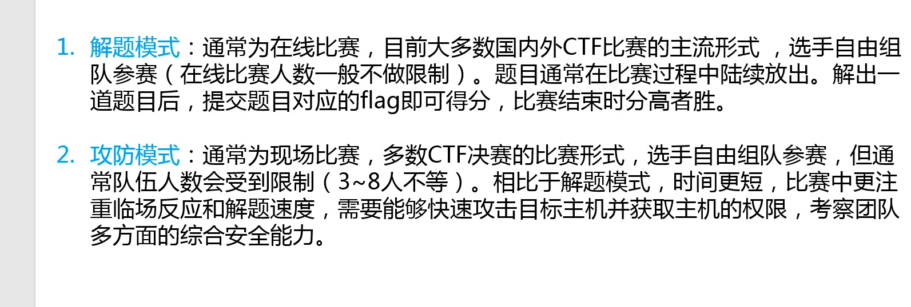
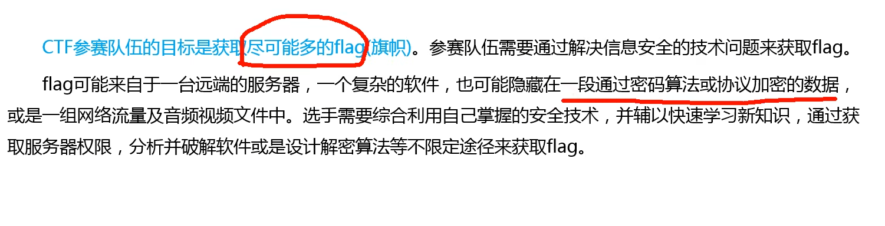
## 题目类型
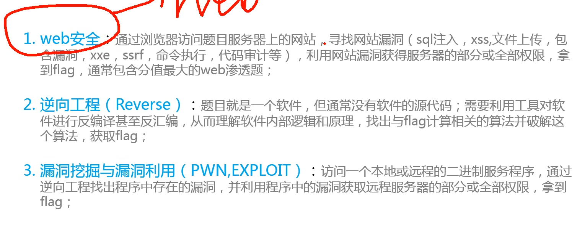
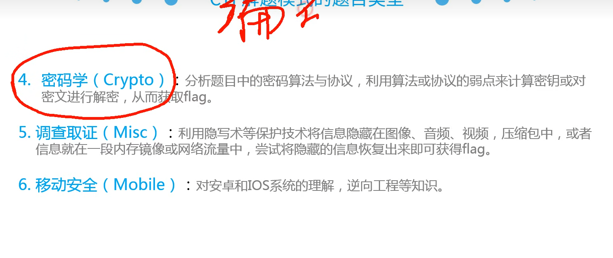
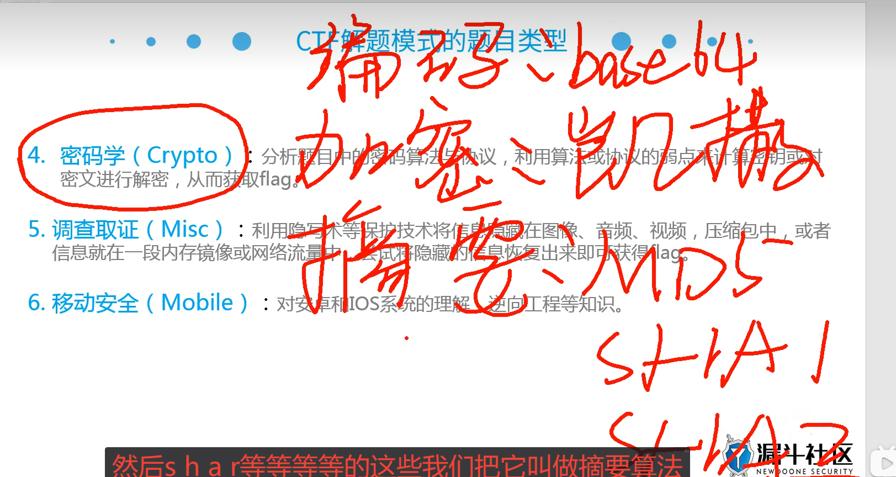
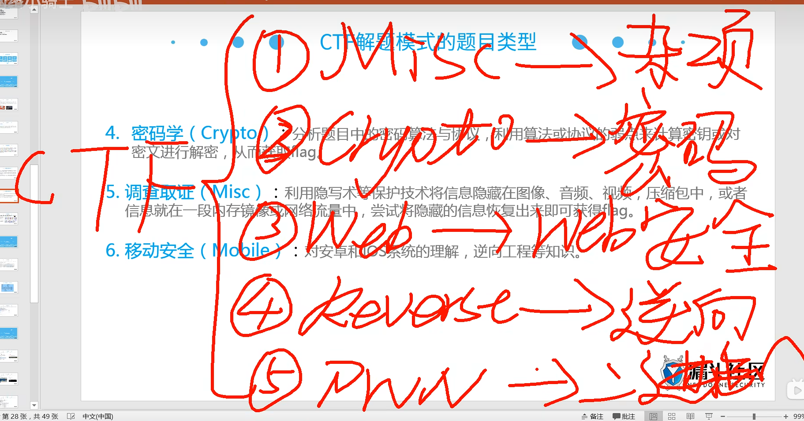

## 学习攻略

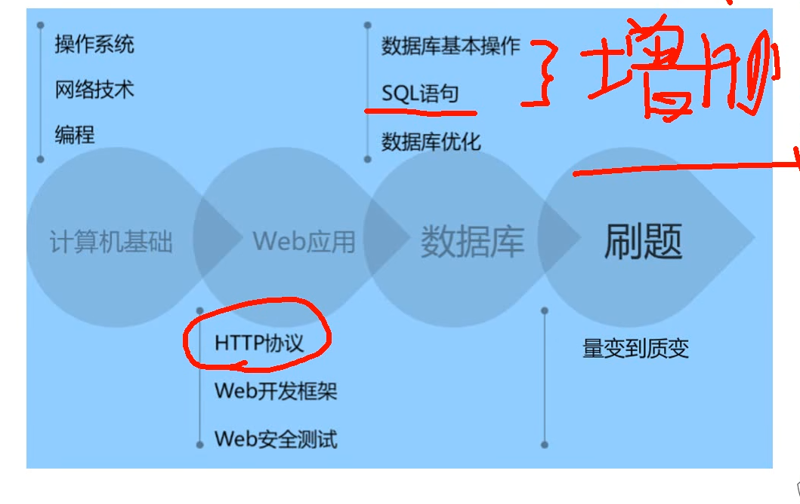
*  网络技术
*  http协议
*  数据库的基本操作，Sql语句（增删查改，ADFC），数据库优化

## 在线演练

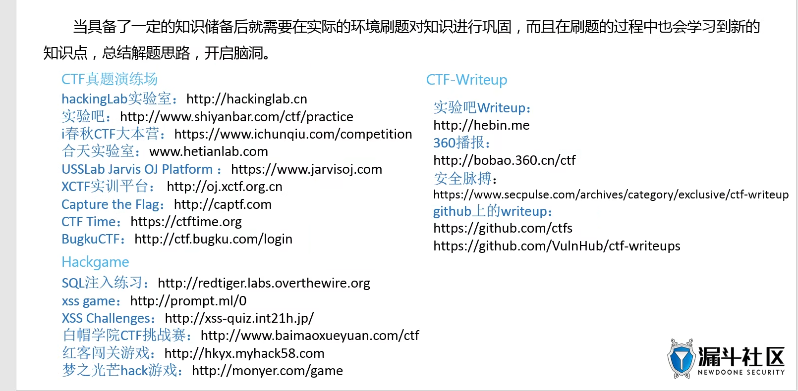

    实验吧：http://shiyanbar.com/ctf/practice
    BugkuCTF: http://ctf.bugku.com/login
# 软件
    vm，bp
    kalilinux:已经安装了很多的软件和工具
## 已下载火狐延长版
```bash
    firefox-esr
```

# 杂项的解题思路

## 文件类型的识别

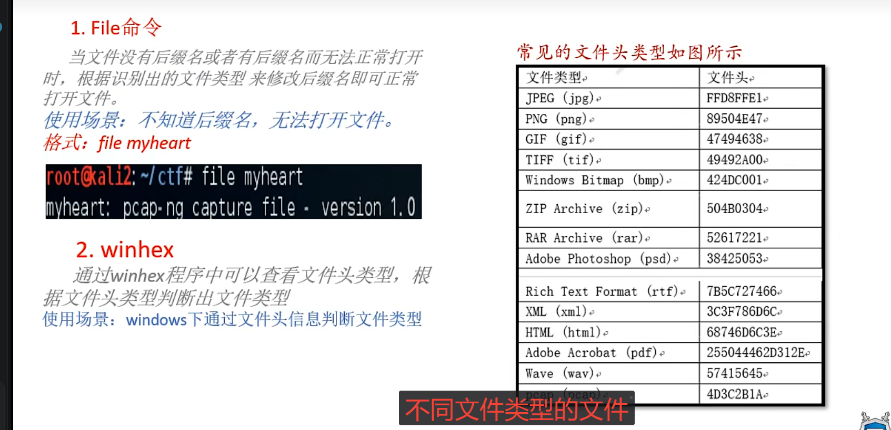
```bash

    file xxxx
```
    更改后缀名，可以将文件的原貌得出
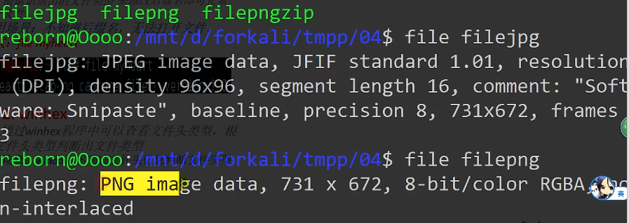

```bash
    winhex //通过识别文件头，用于windows下的情况
```

```bash
    010editor filename
```
    通过010编辑器打开文件，通过查看头文件的第一位16位数值来判断是什么文件

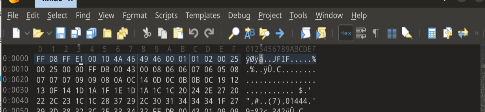

## 文件分离

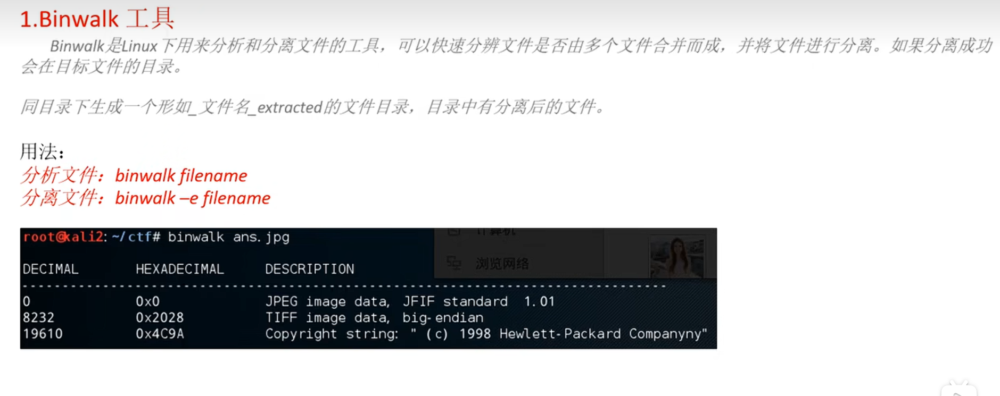

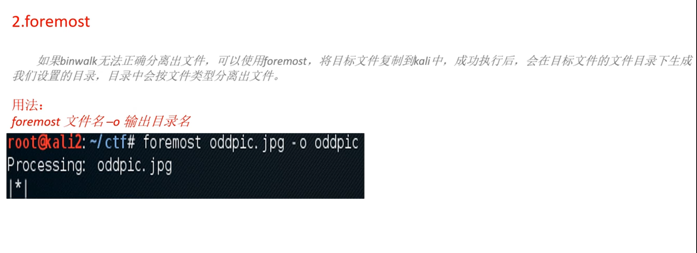

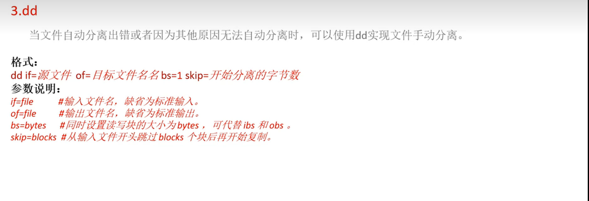