## 网络设备  
 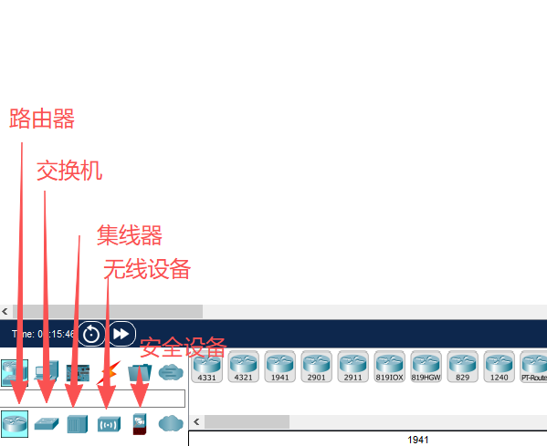  

## 终端设备  
 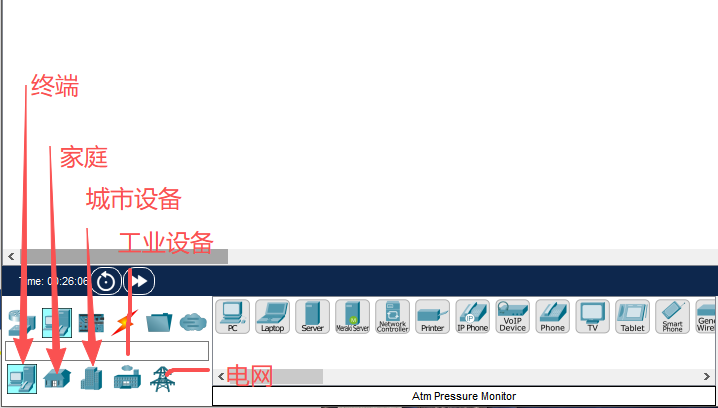  

## 接口  
 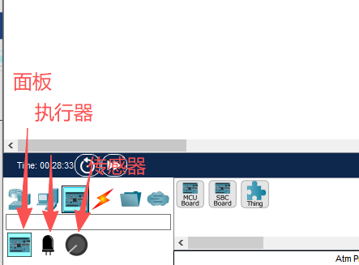  

## 物理界面
 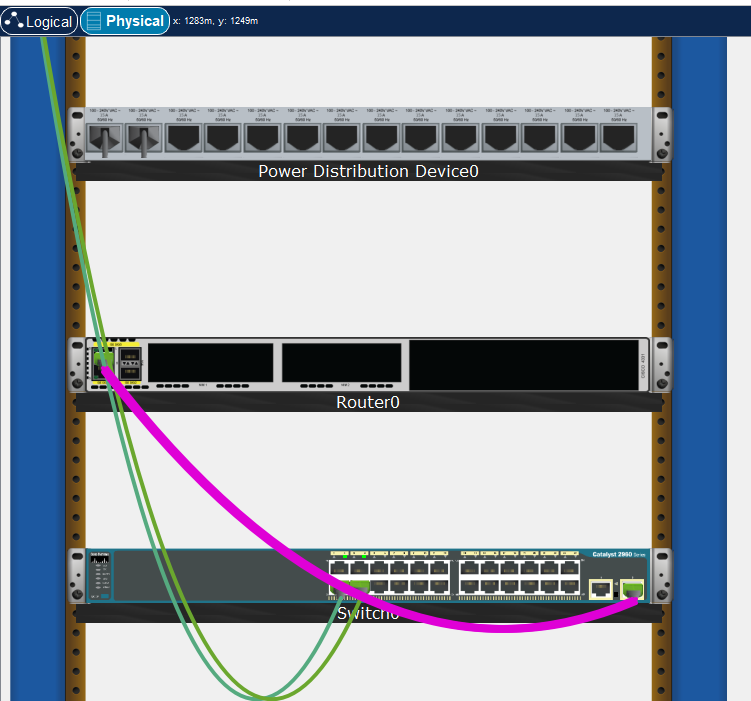  
 可以右键来管理线缆
    Shift + P 切换物理模式
    Shift + L 切换逻辑模式
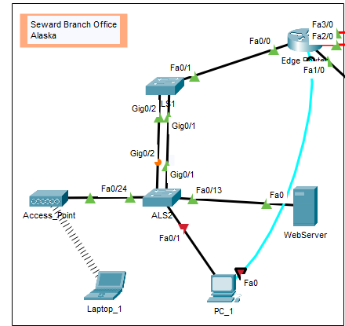
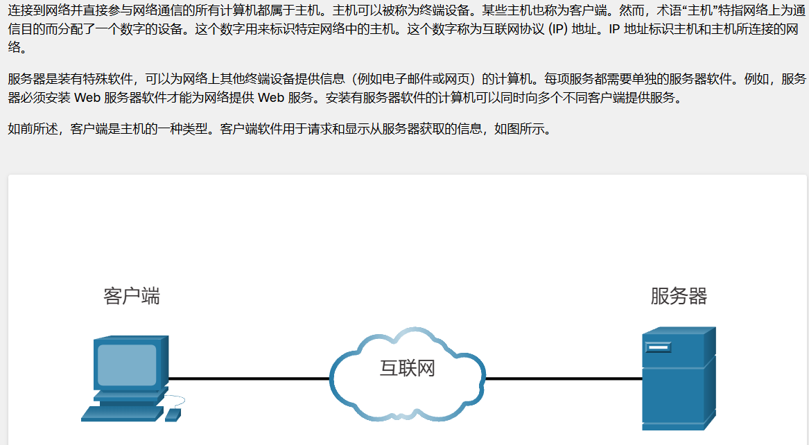
## 点对点
    客户端和服务器软件通常部署在一个独立的服务器上  
    当一个计算机也可以担任两个角色  
    在小型网络中，许多计算机在网络中即是，又是服务器又是客户段，这被称为对等网络  
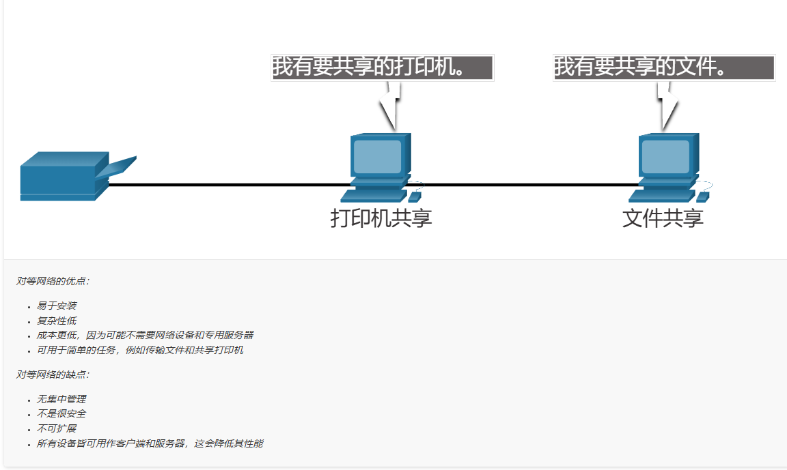
## 终端设备
    为了区分不同的终端设备，每一台终端  
    都有一个地址，当一台终端设备发起通信的时候，会使用目的终端设备的地址来指定消息发到哪里去
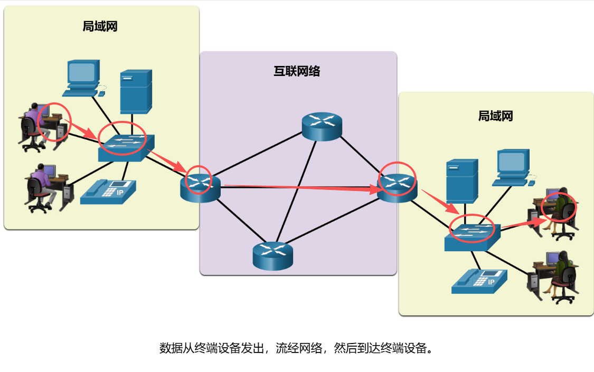
## 中间设备
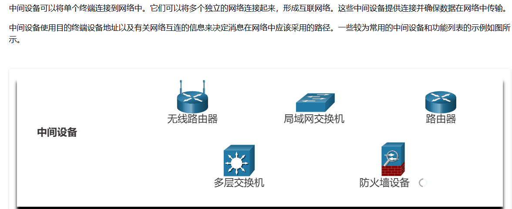
## 网络介质
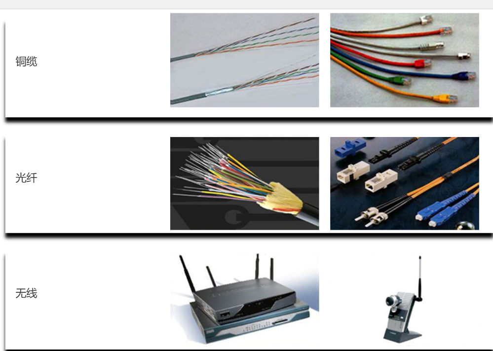
## 网络表示
    方便理解
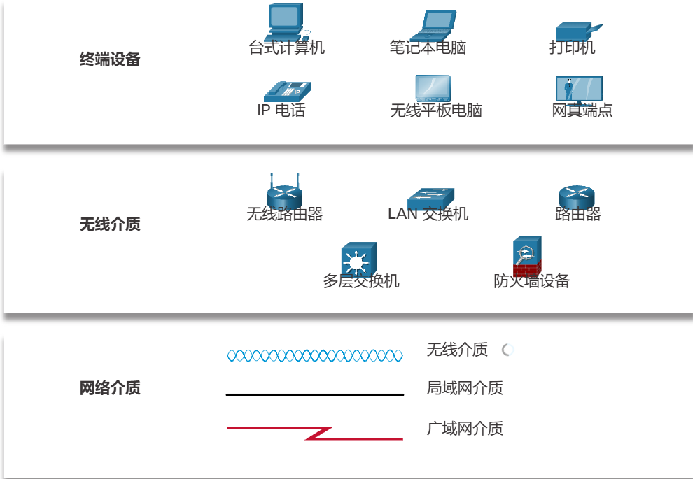
    网络接口（网卡INC）：将设备物理连接到网络。
    物理端口：物理设备上的接口或插口
    接口：网络设备上连接到独立网络的专用端口，在路由器上也成为网络接口
## 拓扑
    物理拓扑
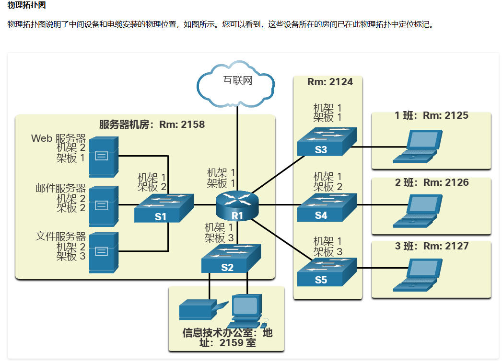
    罗技拓扑
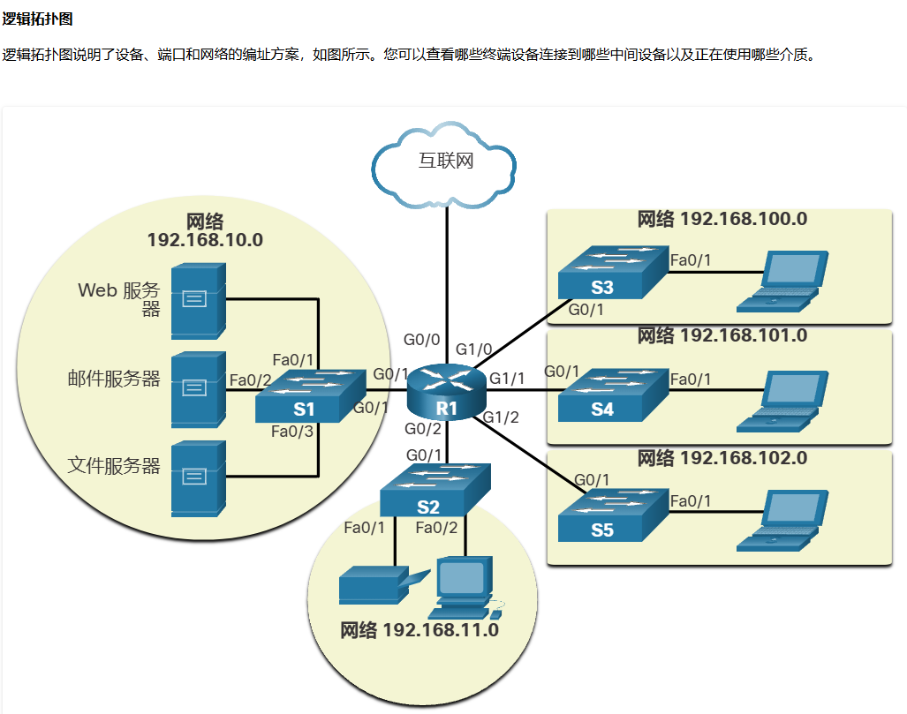
  
LAN局域网：覆盖范围较小
WAN广域网：由多lan组成

## terminal

    PC的terminal界面需要console线连接switch来控制  
    先输入enable进入Switch的管理界面#  

```bash
    configure terminal //进入全局配置界面
    eixt //返回上一级
    line console 0 //进入子路配置模式
    end //返回到普通模式
    ctrl + Z
```
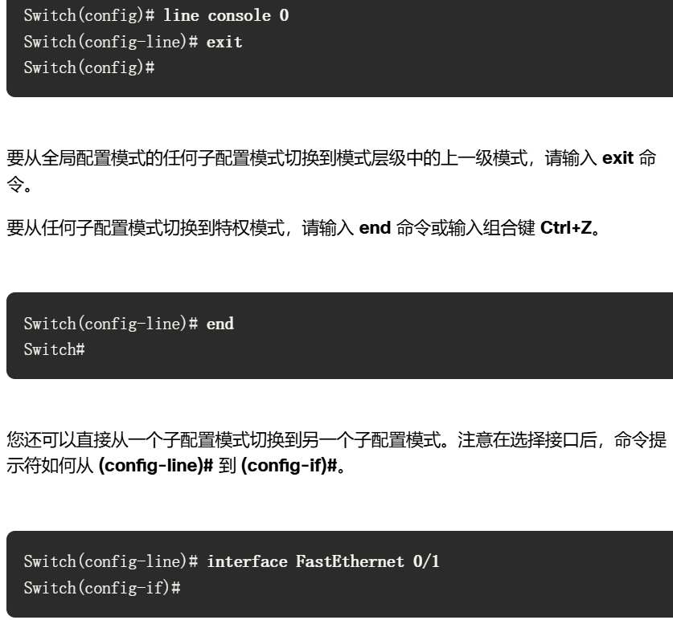

## 基本的IOS命令结构

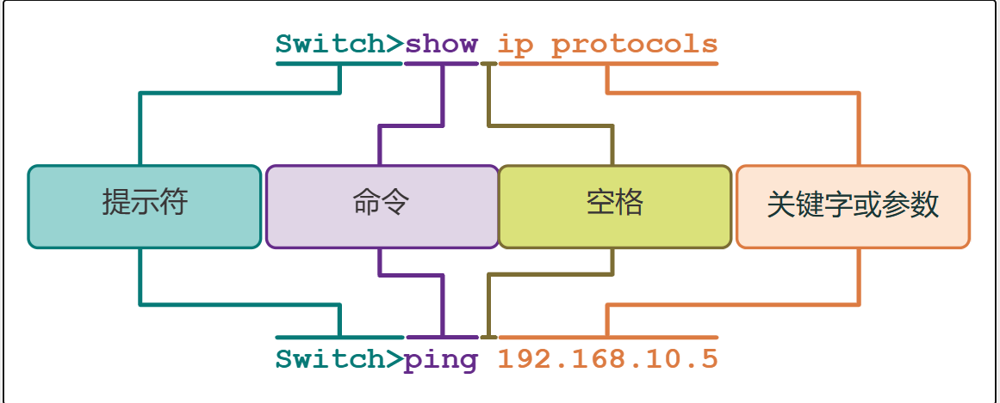

## Cli的指令热键

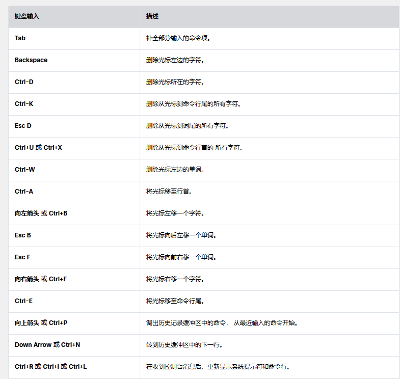