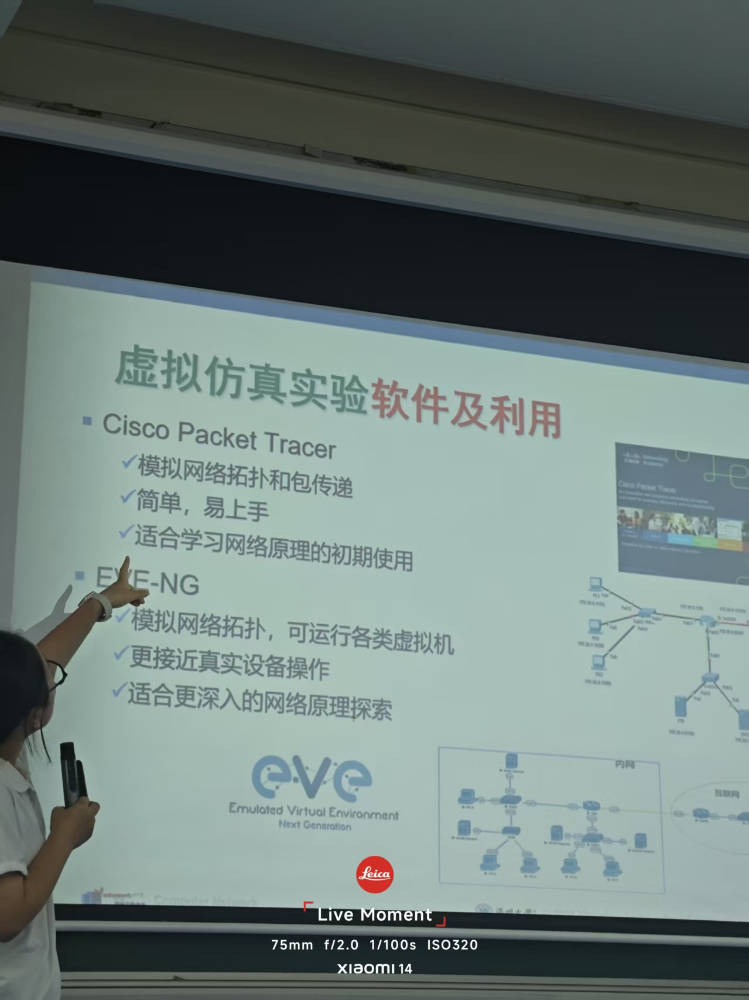
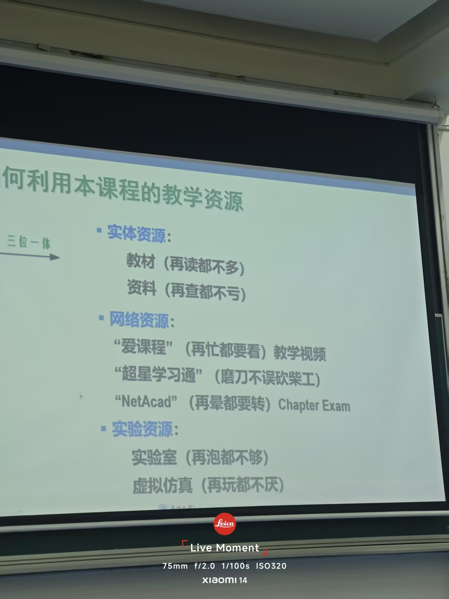
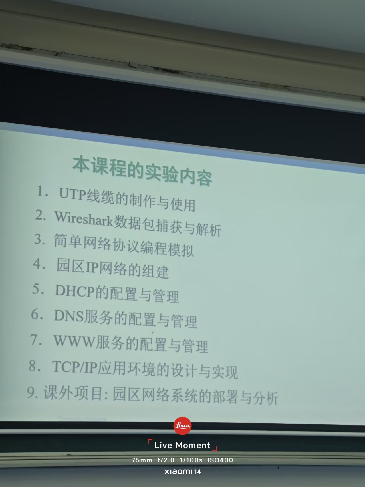

# To begin with
我是一名温州大学25网工的学生  
嗯。对就这些。  
接下来就是我的学习记录  

    大徐ftp：ftp://10.5.12.200/
    微信小程序：ftp://10.132.219.5:303/
    小徐：10.132.219.5:8380
    葛一粟：ftp://10.132.219.5:5883/
日期:2026.9.10  
```c
    #include<bits/stdc++.h>
    using namespace std;
    int main()
    {
        int a;
        cin >> a;
        cout << a;
    }
    这是测试
```
如何运行这个Blog
```bash
    D:\Blog>docsify serve .
```

  
  
  
[CISCO网址](https://www.netacad.com/)  
```bash
    git add .
    git commit -m "更新DAY3"
    git push
```  