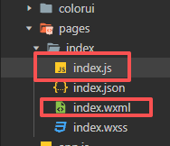
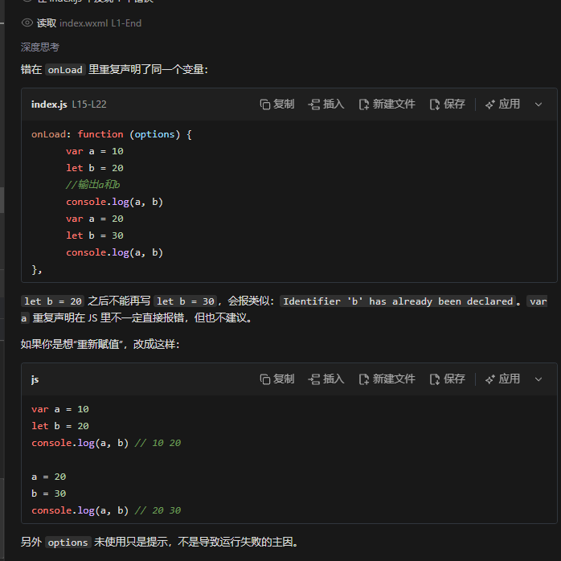
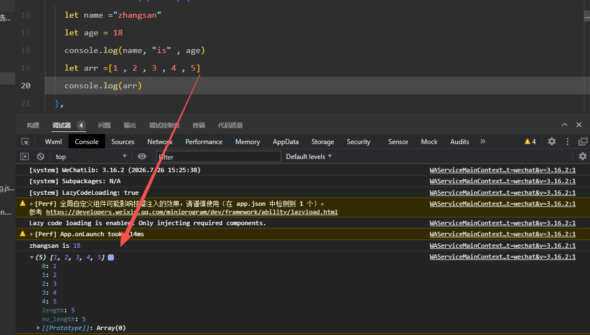
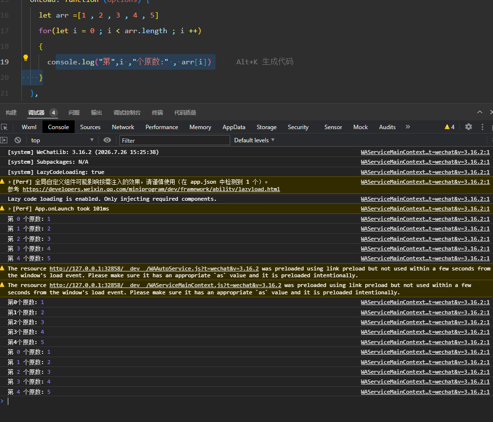
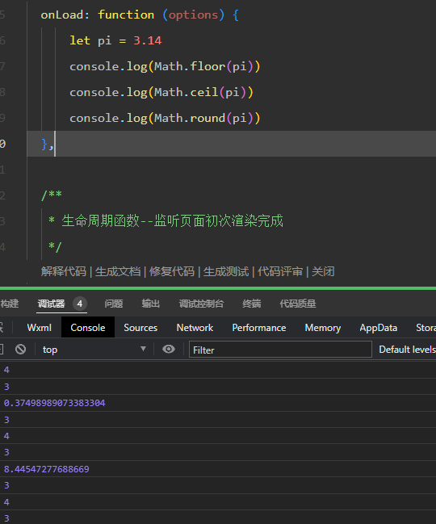
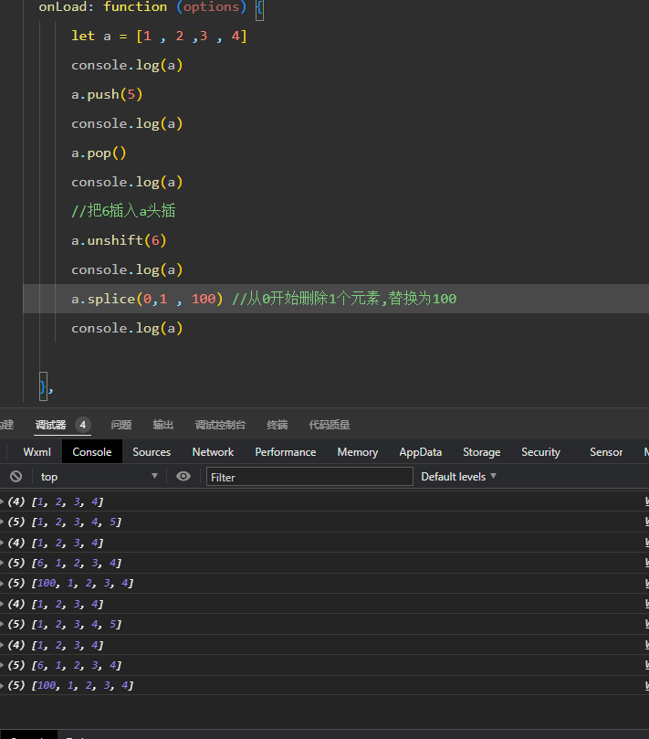

    应用程序开发是基于事件的
### Javascript

#### 语法

##### 变量
    定义变量 
```javascript
        var a = 10
        let b = 20
        //输出a和b
        console.log(a, b)
        let c = 'a'
        console.log(c)
        let d = "woshidasabi"
        let e = [1, 2, 3, 4, 5]
        let f = ["a", "b", "c"]
        //console是控制台 .log是日志
    
```

```javascript
    let name ="zhangsan"
    let age = 18
    console.log(name, "is" , age)
    let arr =[1 , 2 , 3 , 4 , 5]
    console.log(arr)
    //arr.length   arr的长度
    
```
  

  



-
