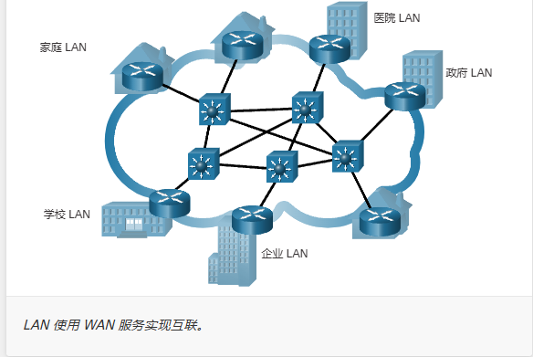 
## 家庭Internet连接

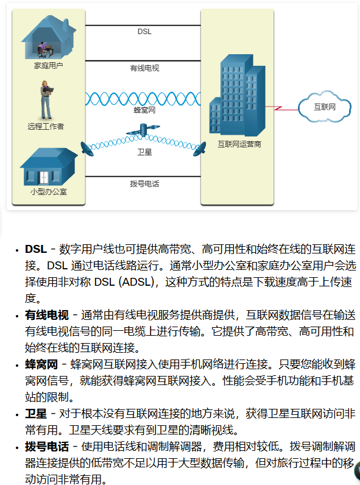
## 企业Internet连接

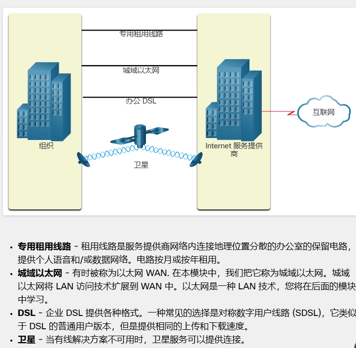
## 冗余网络  

    通过冗余接口以及分组交换来实现  

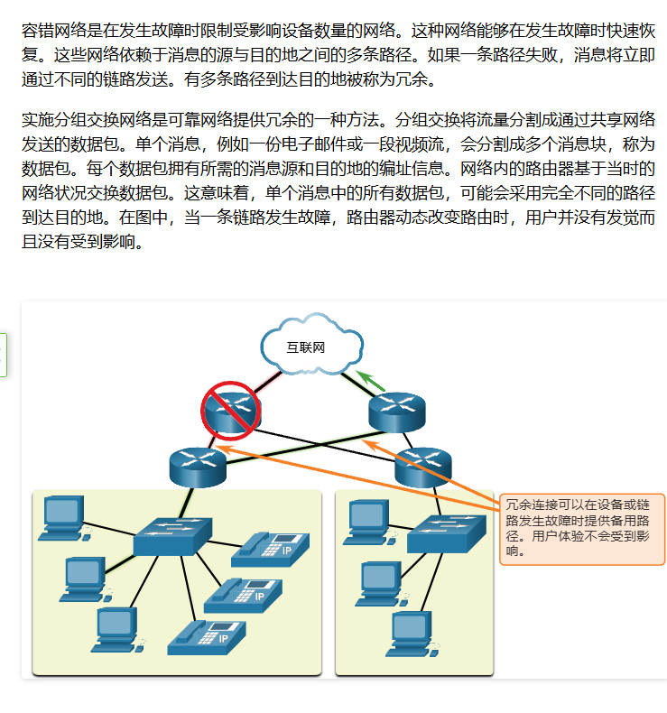

## 可拓展性

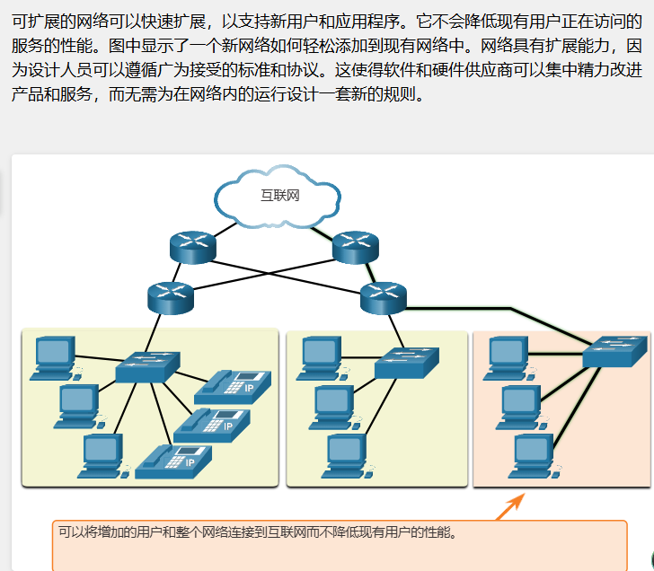
## 网络安全

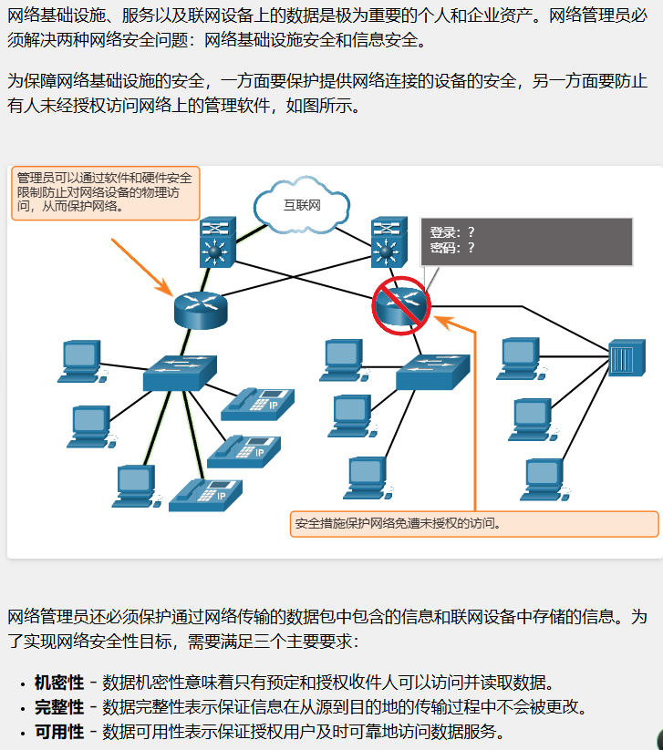
## 服务质量

    位/秒（bps），8 bits = 1 Bytes 
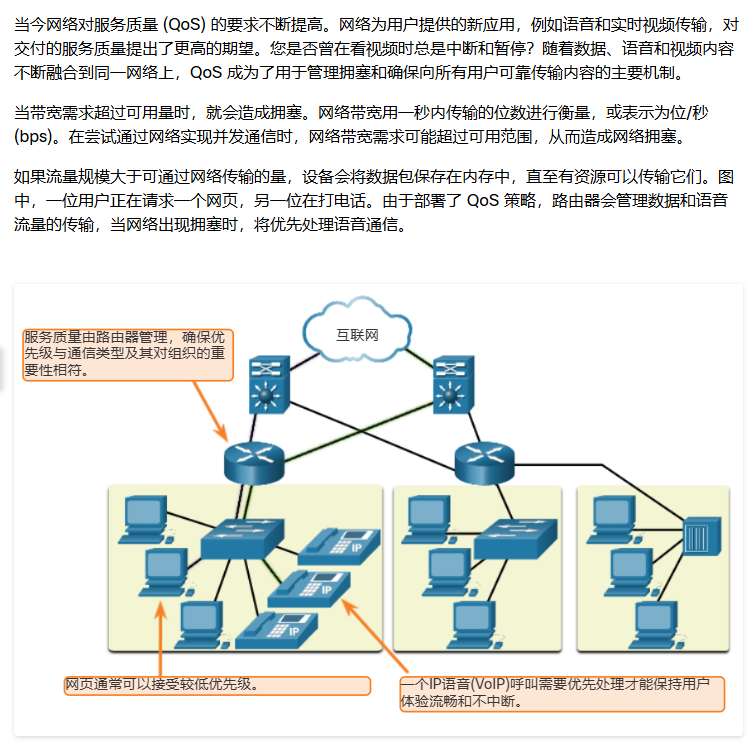
## 云类型

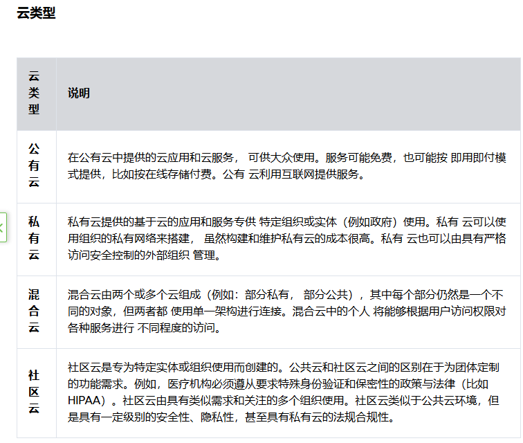  

## 网络安全解决方案
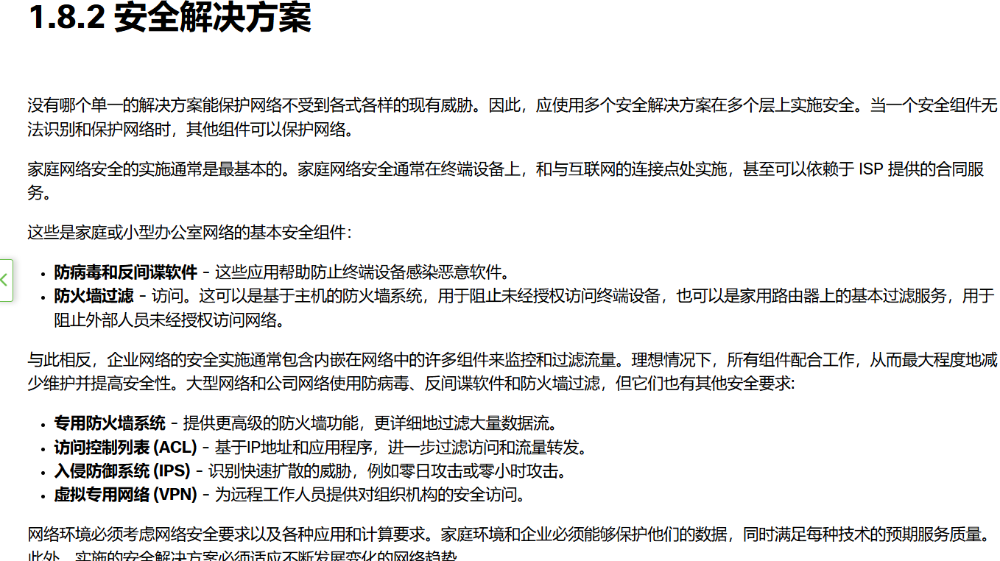 
## TEST
    问题一
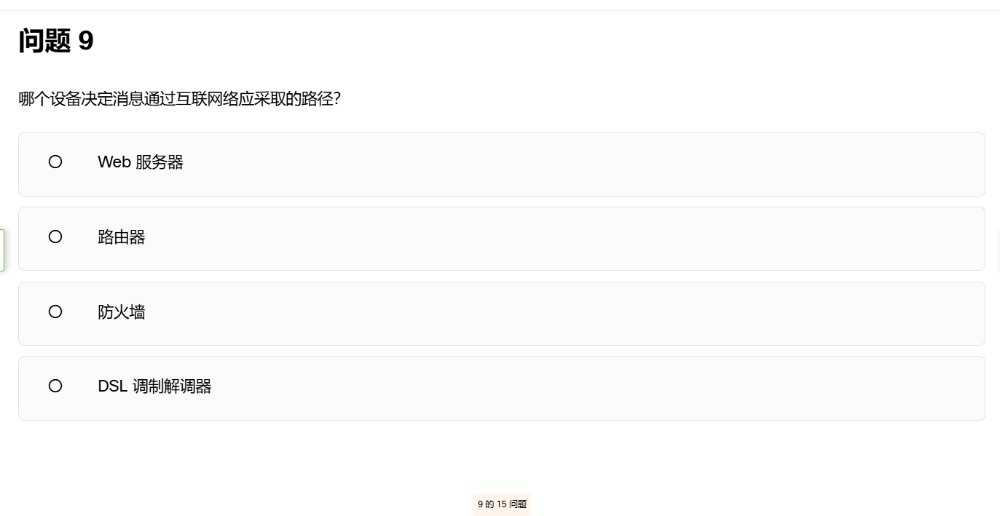
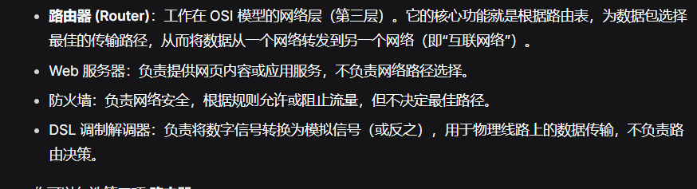
    BYOD（Bring Your Own Device）

## 交换机和终端设备的基本配置

### 访问方式

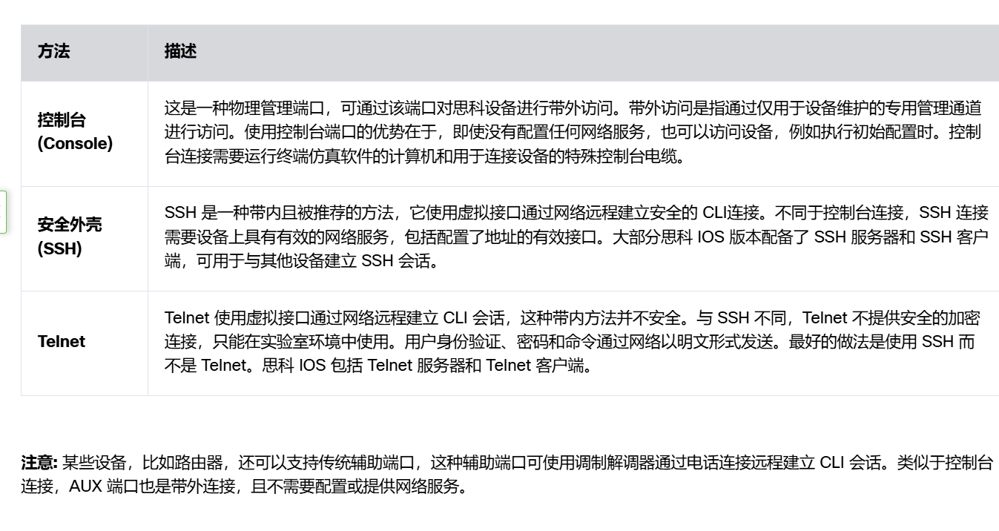

### 命令格式
    用户EXEC模式（仅查看，访问有限的局部监控指令）  
    Switch>  
    Router>
    特权EXEC模式（允许所以指令）

[第一次思科作业](/思科网院/第一次作业/test1.md)
