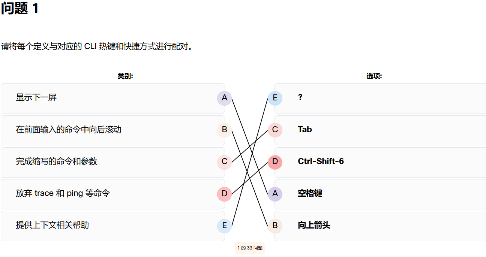
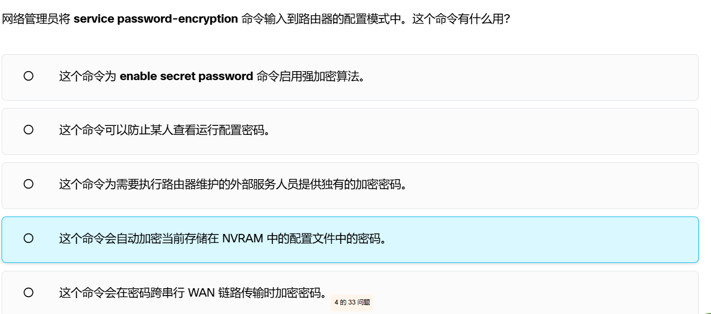
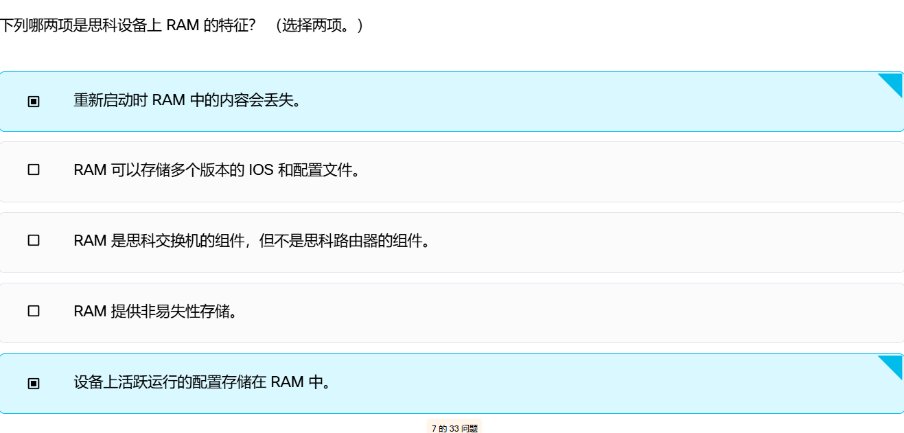
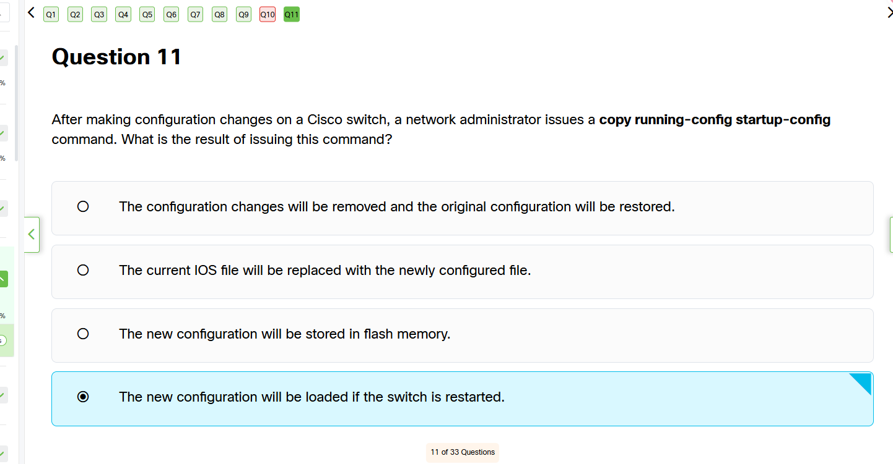
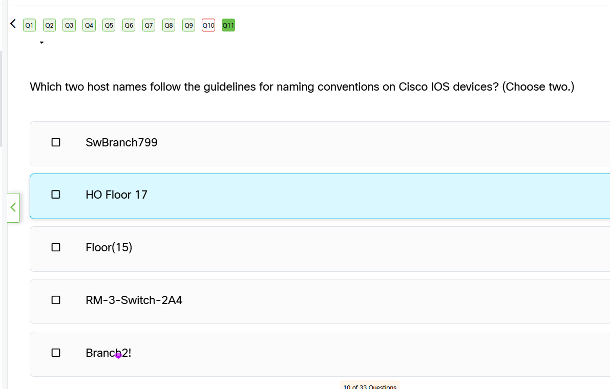
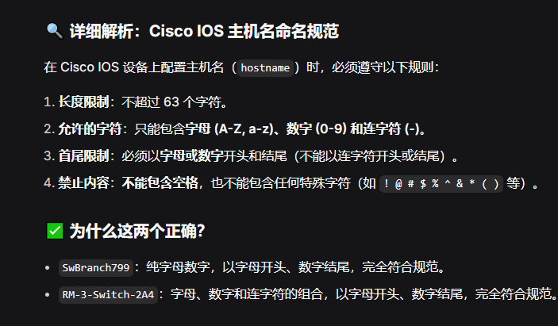
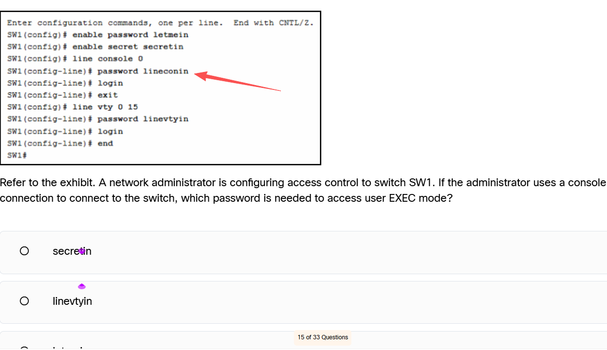
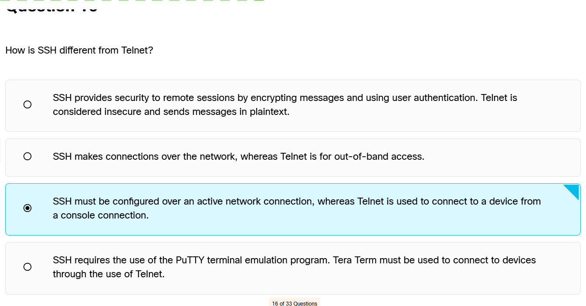
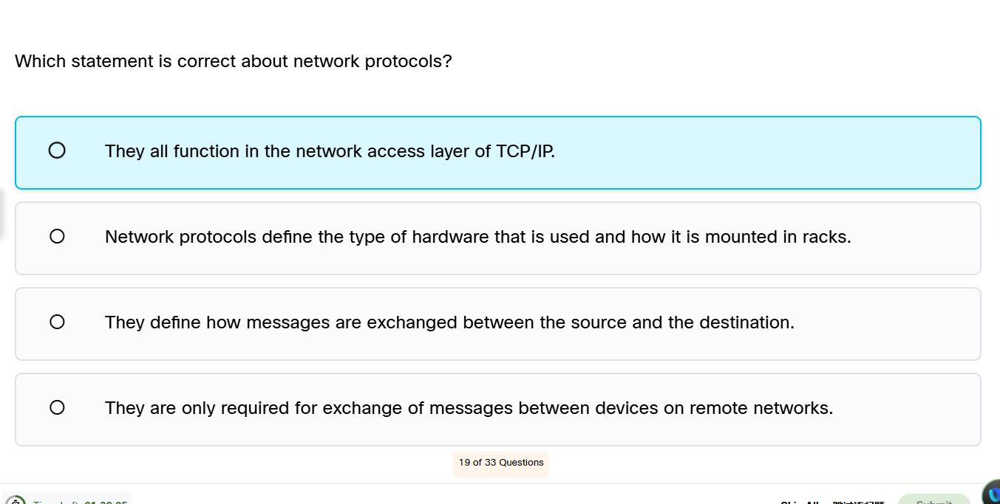
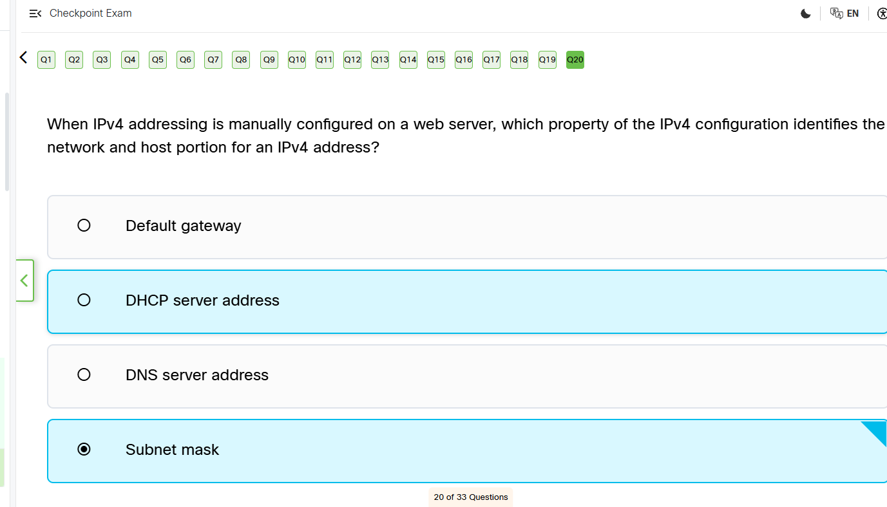

    选D









## Cisco 设备访问控制与密码验证逻辑

### 不同访问方式对应的密码
| 访问方式 | 进入的命令行层级 | 对应配置 | 密码变量名示例 | 登录后进入的模式 |
| :--- | :--- | :--- | :--- | :--- |
| **Console（控制台）** | `line console 0` | `password xxx` + `login` | `lineconin` | 用户 EXEC 模式 (`>`) |
| **VTY（Telnet/SSH）** | `line vty 0 15` | `password xxx` + `login` | `linevtyin` | 用户 EXEC 模式 (`>`) |
| **特权模式（提升权限）** | 全局配置模式 | `enable secret xxx` | `secretin` | 特权 EXEC 模式 (`#`) |

### 关键命令逻辑
1. **`login` 命令**：必须配置，否则即使设置了密码，设备也不会要求验证。
2. **`enable secret` vs `enable password`**：
   * `enable secret` 使用强加密，推荐使用。
   * 如果两者同时配置，`enable secret` 优先级更高，`enable password` 会被忽略。
3. **访问顺序**：
   * Console 线连入 -> 输入 `lineconin` -> 进入 `SW1>`（用户模式）-> 输入 `enable` -> 输入 `secretin` -> 进入 `SW1#`（特权模式）。

### ⚠️ 易错点提示
*   题目问“进入用户模式”，找 Console 或 VTY 的密码。
*   题目问“进入特权模式”，找 `enable secret` 的密码。
*   千万不要搞混“Console 口密码”和“VTY 密码”。
*   

## SSH 与 Telnet 的区别（必考）

### 核心对比
| 特性 | SSH (Secure Shell) | Telnet |
| :--- | :--- | :--- |
| **默认端口** | **22** | **23** |
| **安全性** | **高**（加密传输） | **极低**（明文传输） |
| **数据形式** | 密文，中间人无法轻易解读 | 明文，密码和命令一览无遗 |
| **认证方式** | 支持密码、密钥对 | 仅支持密码 |
| **生产环境** | 推荐使用 | 严禁使用 |

### 带内管理 vs 带外管理（易错点）
*   **带内管理（In-band）**：通过业务网络远程连接设备，使用 **Telnet** 或 **SSH**。需要设备配置好 SVI 或物理口 IP 地址。
*   **带外管理（Out-of-band）**：不依赖业务网络，通过物理线缆连接，使用 **Console 口**（或 AUX 口）。通常用于设备初始配置或网络瘫痪时的应急恢复。

### ⚠️ 终端软件误区
*   PuTTY、SecureCRT、Tera Term、Xshell 等都是**终端仿真软件**。
*   它们只是一个“客户端工具”，既支持 SSH 也支持 Telnet。不要把它们和协议本身绑定起来。

### 配置示例：在 Cisco 设备上启用 SSH（替代 Telnet）
```bash
Switch(config)# hostname SW1
SW1(config)# ip domain-name example.com
! 生成 RSA 密钥对（SSH 必须）
SW1(config)# crypto key generate rsa modulus 1024
! 配置用户名密码（SSH 建议用本地认证）
SW1(config)# username admin secret cisco123
! 限制 VTY 线路只允许 SSH
SW1(config)# line vty 0 15
SW1(config-line)# transport input ssh
SW1(config-line)# login local
SW1(config-line)# exit

```


## 网络协议 (Network Protocols) 的核心概念

### 什么是网络协议？
网络协议是设备之间进行通信时共同遵守的**规则集合**。它定义了：
1. **消息格式**（语法）：数据长什么样。
2. **消息含义**（语义）：数据代表什么意思。
3. **交换顺序与速率**（时序）：什么时候发、发多快。

### ⚠️ 做题避坑指南（CCNA 常见陷阱）
在选择题中，带有以下词汇的选项通常是错误的：
*   **all（所有）**：如“所有协议都工作在某一层”。
*   **only（仅仅）**：如“协议仅仅在远程网络通信时才需要”。
*   **hardware / racks（硬件/机架）**：网络协议是逻辑规则，不定义物理硬件安装方式。

### 协议分层实例（TCP/IP 模型）
| TCP/IP 层级 | 典型协议 |
| :--- | :--- |
| **应用层** | HTTP, FTP, DNS, SMTP |
| **传输层** | TCP, UDP |
| **网际层** | IP, ICMP, OSPF |
| **网络接入层** | Ethernet, ARP, PPP |

### 核心结论
网络协议定义了**源和目标之间如何交换消息**。无论是局域网内还是跨互联网，只要设备需要通信，就需要协议。



