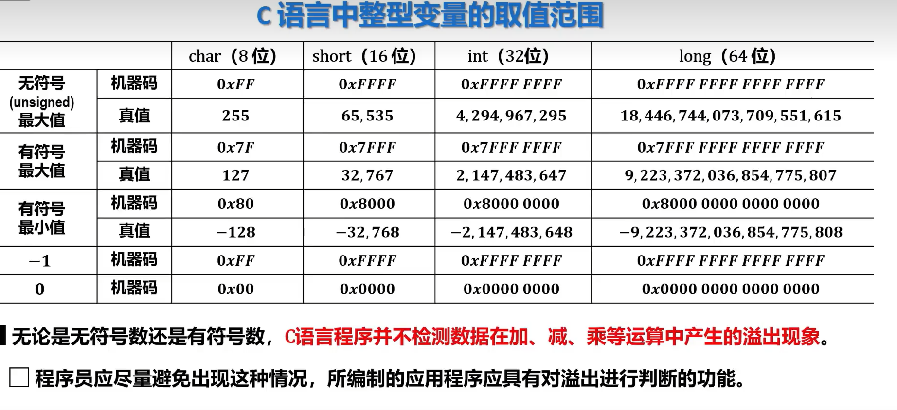
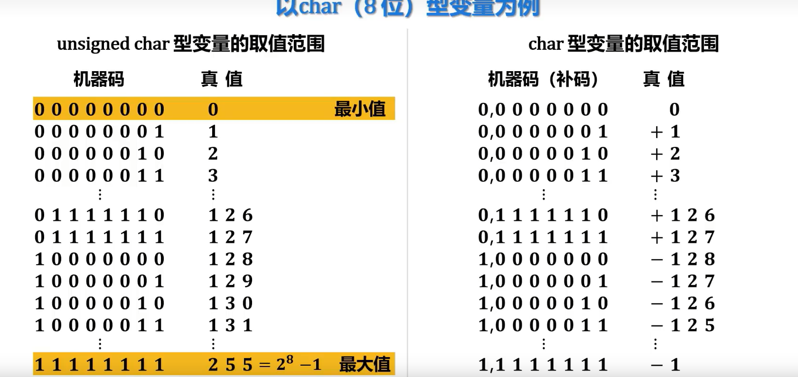
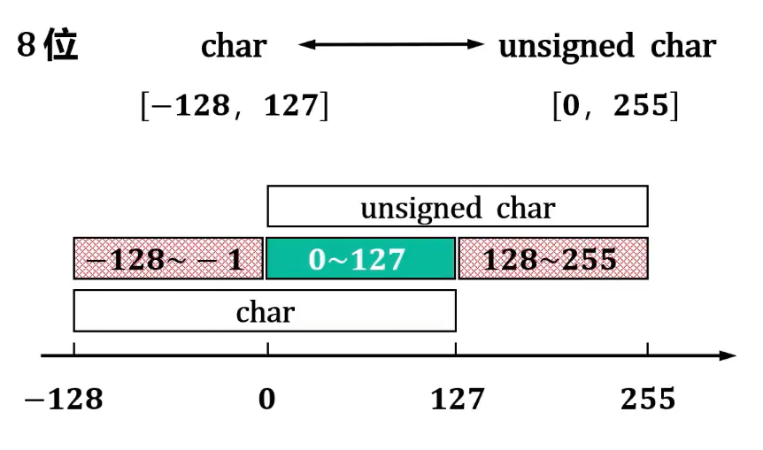
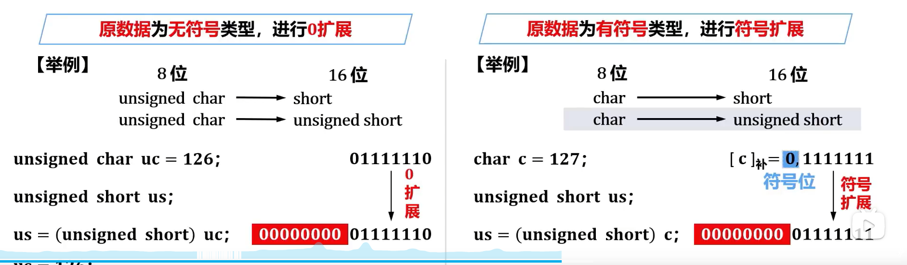
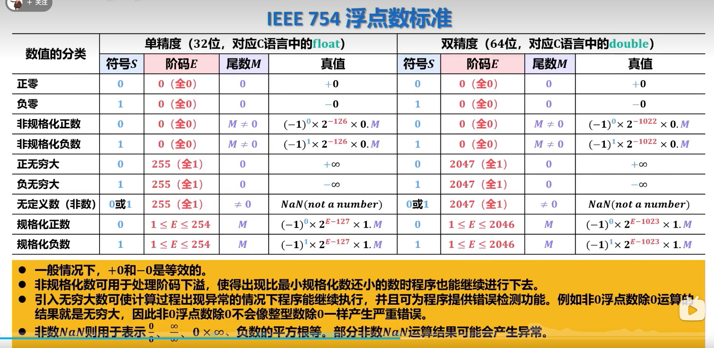
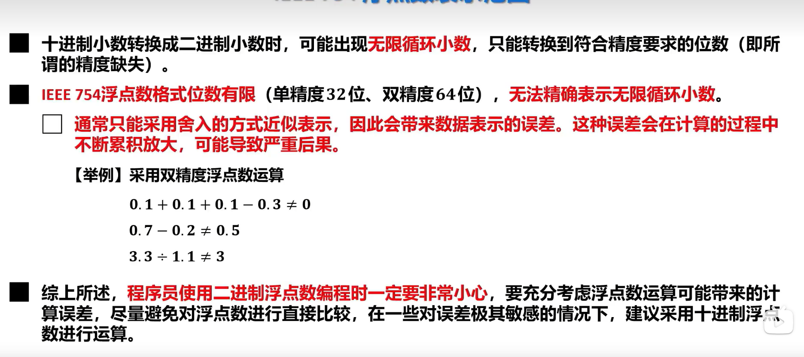

## 原码补码反码


## 期末重点（浮点数的表示）
    在数据中全E为全 1 代表
    {
        1，M全为0，根据S判断+- 无穷
        2，M不为全0，为非数值NAN
    }
    所以最大的正数和最小的负数E为全一 —— 1
### fp32(1S 8E 23M)

    移码为127（7FH）
    V = (-1)^s * 1.M * 2^(E - 7FH)   ( 1<=E <= FEH（254）)
    V = (-1)^s * 0.M * 2^( -126 )    (E 为00H)

### fp16(1S 5E 10M)
    移码为15（0FH）
    V = (-1)^s * 1.M * 2^(E - 0FH)   ( 1<=E <= 0EH)
    V = (-1)^s * 0.M * 2^( -14 )    (E 为00H)

### 总结
    只要E为8为移码就是7FH，5位0FH
## c语言的类型
    如何判断是什么数据类型，在汇编语言中由操作数决定
    默认是有符号整数，加上Unsigned的为无符号整数  

### char 8位
### short 16位
### int 32 位 
### long 64 位
### float 32位(IEEE 754)
### Double 64位（1S 11E 52M）

## 类型转换

#### 整型数据

##### 相同字长（有无符号的转化）
    [-128,127]char  <---> unsigned char[0 , 255]  
        unsigned char = [0 , 2 ^ 8 - 1]  
    char = [ -128 , 127 ]

    重叠范围转换后 数据与原值相同
    不重复范围  
    ex1  
    {
```c
    unsigned char uc = 255; // 1111 1111
    char c = char (uc);
    c = -1;                 //[c]补码=1,111 1111
                            // -1 ,取反
```
}

#### int，float ，double的转换
    小字长转大字长  
- 原数据位无符号类型，进行0拓展  
```c
    unsigned char uc = 254;     1111 1110
    short s;                    
    s = (short) uc;             0000 0000 1111 1110 //用补码解释
    s = 254
```
- 原数据为有符号类型，进行符号拓展  

```c
    char c = -128;     1000 0000
    short s;                    
    s = (short) c;             1111 1111 1000 0000 //用符号位补，用补码解释
    s = -128
```

## IEEE754的标准

