## IPv4地址由32为bit组成，两部分：网络号，地址号  

### 子网划分:
    地址号全0或1不能使用（全0为网络地址，全1为广播地址）
#### A类   
    8位网络号------24位地址号  
    0XXX XXXX XXXX XXXX XXXX XXXX XXXX XXXX
    127.X.X.X地址不出网卡，仅用于本地环回测试
    可用网络号  0-126
#### B类
    16位网络号------16位地址号
    10XX XXXX XXXX XXXX XXXX XXXX XXXX XXXX
    可用网络号 
#### C类
    24位网络号------8位地址号
    110X XXXX XXXX XXXX XXXX XXXX XXXX XXXX
## 子网掩码
    网络号+子网划分+地址号  
    子网号和地址号，都在地址里
    比例  
    网络号 子网号  地址号
    0000 0000 1000 0000 0000 0000 0000 0001  
    子网掩码是该网的网络地址和带子网号的网络地址的逻辑与运算  
    EX1:0000 0000 1000 0000 0000 0000 0000 0001
        子网掩码：0.128.0.0.0  
        该情况下  
        子网0的最小地址: 0000 0000 0000 0000 0000 0000 0000 0001
        最大地址:0000 0000 0111 1111 1111 1111 1111 1110
        广播地址:0000 0000 0111 1111 1111 1111 1111 1111
    EX2:0000 0000 1111 0000 0000 0000 0000 0001
        子网掩码：0.240.0.0.0
## 拓扑
    将网络中的设备抽象成点，连接抽象成线
### 总线型（Bus）

### 星型  

### 树型（拓展星型）  

### 环形  

### 网状型   

### Router 与 Switch

## xx
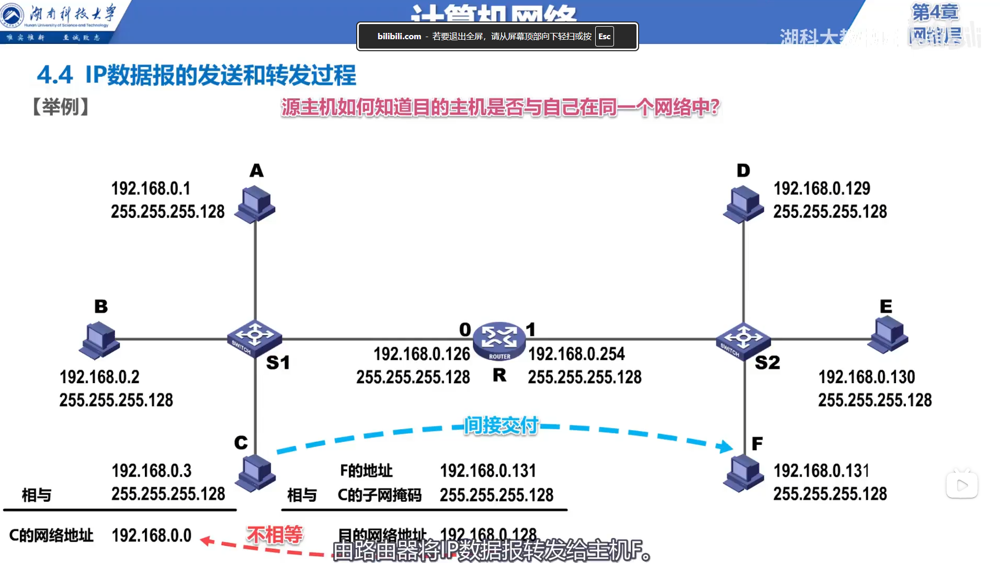  

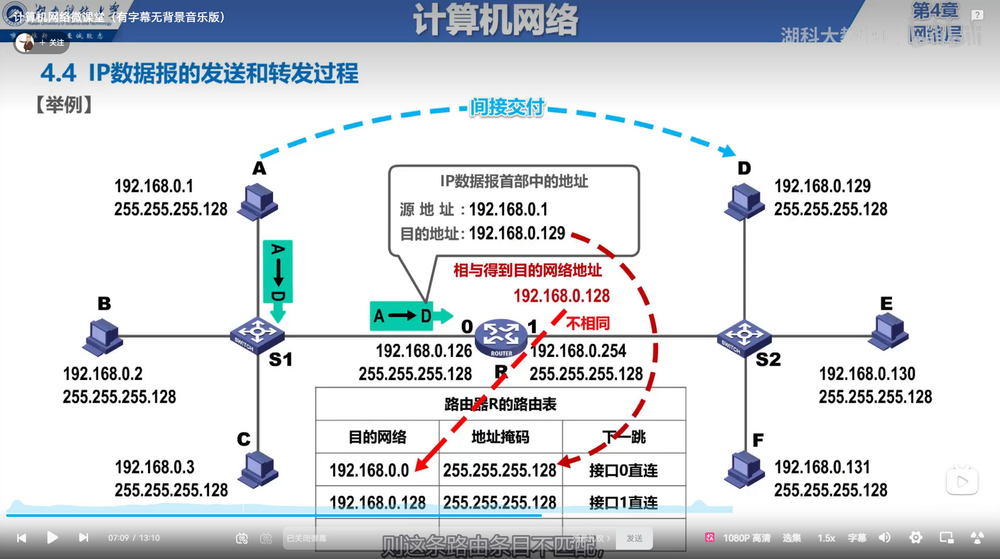  

    IP数据报中的目的地址与路由表中的子网掩码进行与运算  
    得到一个网络地址，与目的地址比较，若是目的地址则，从记录的端口转发  

## 路由协议

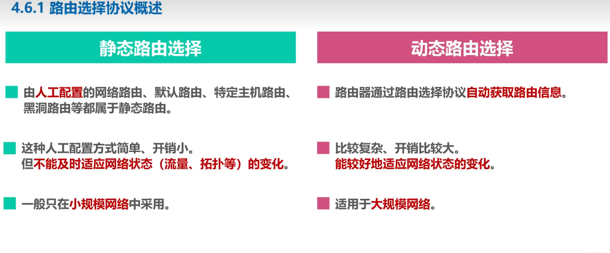

### 分层次

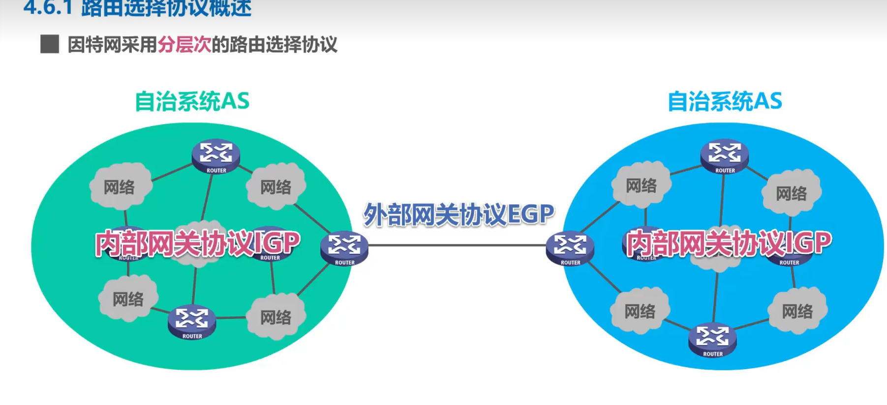

### 常见协议

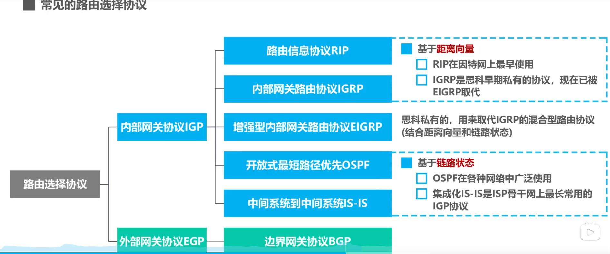

### 路由器的结构

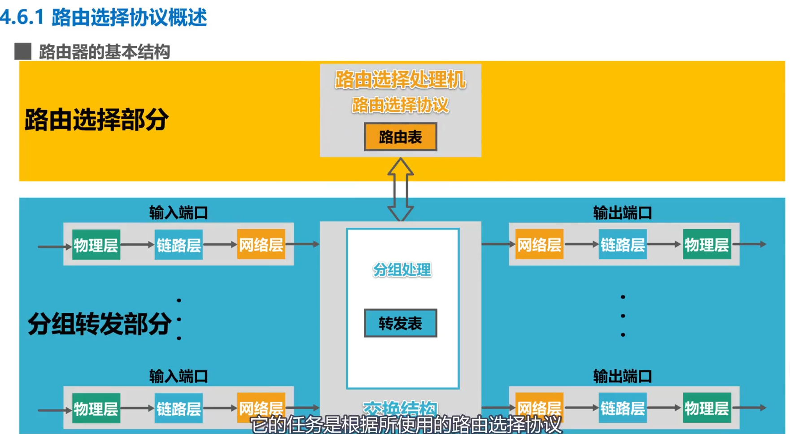

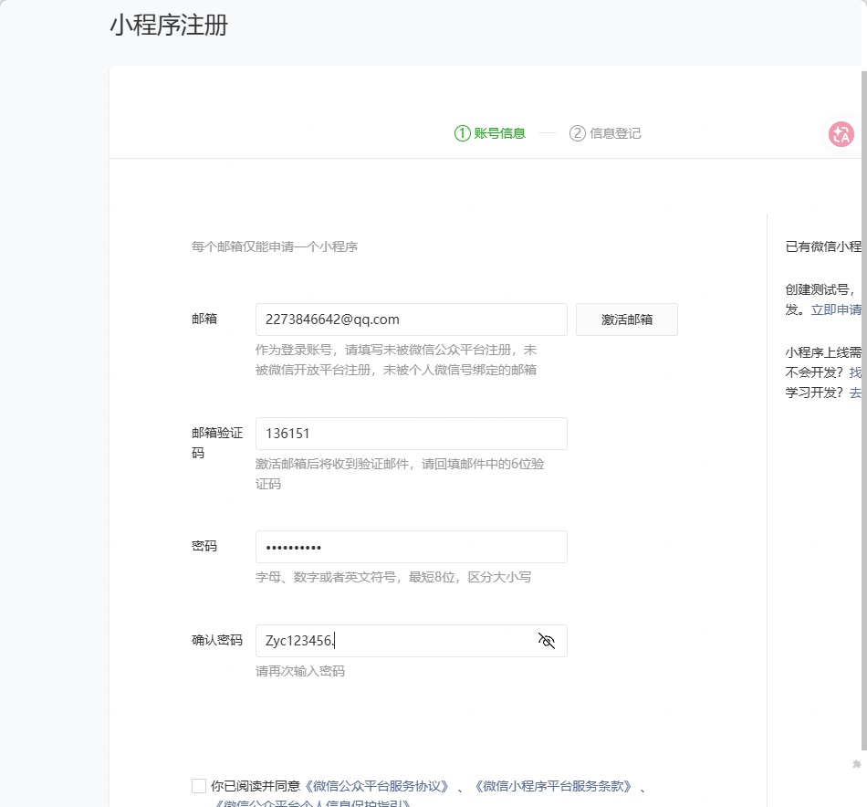

### RIP工作原理

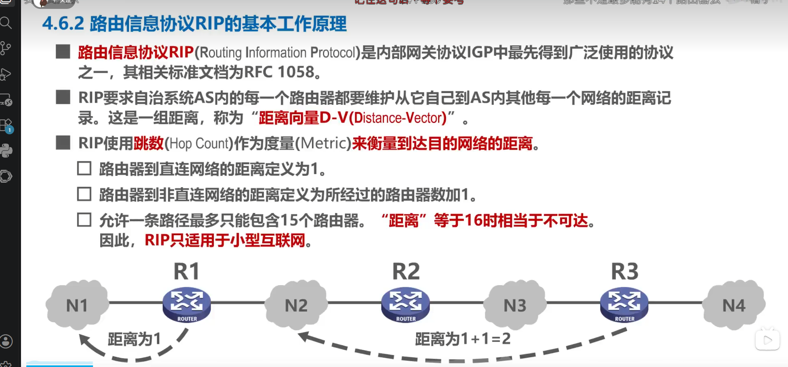

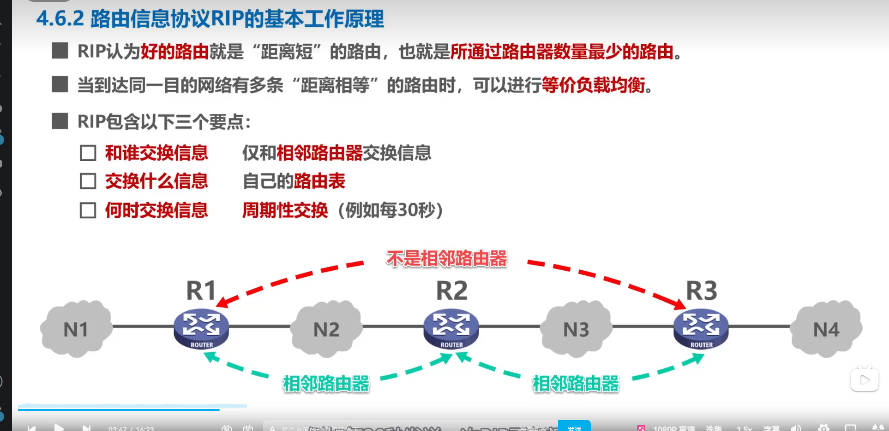

#### 工作过程

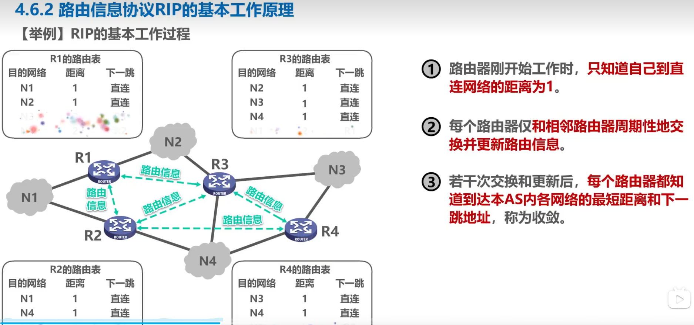

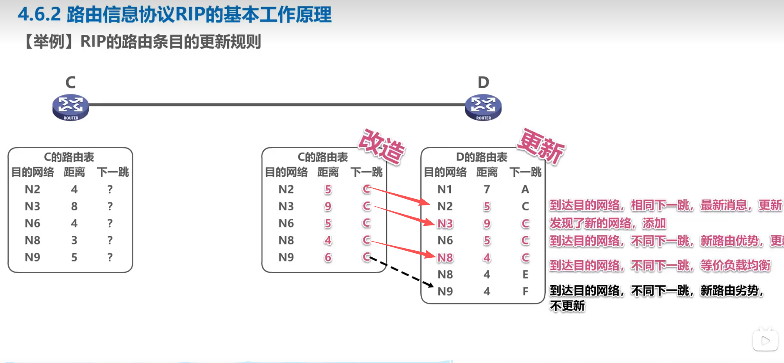 

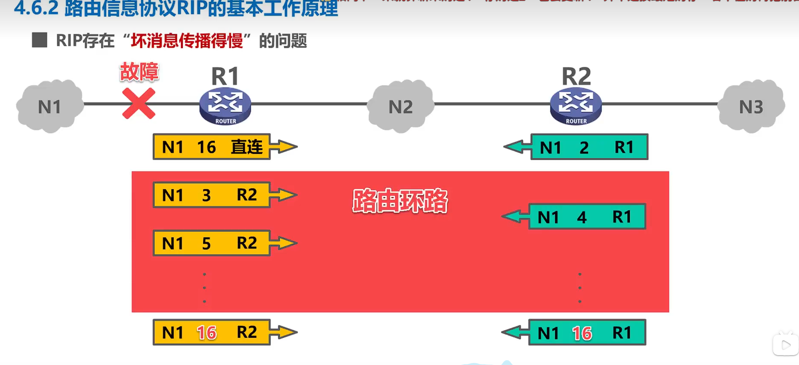

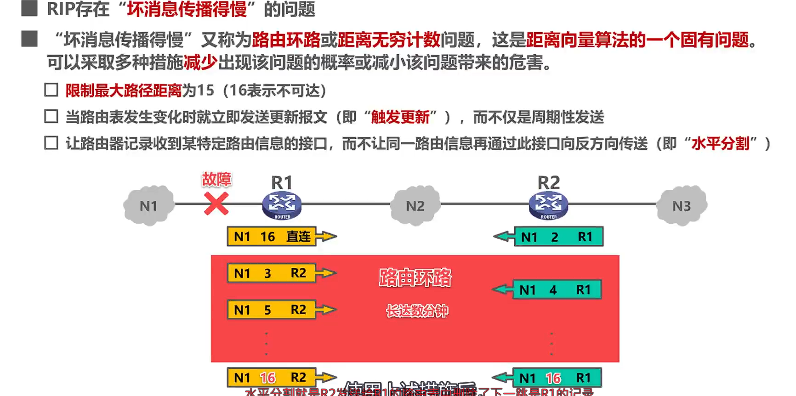
总结
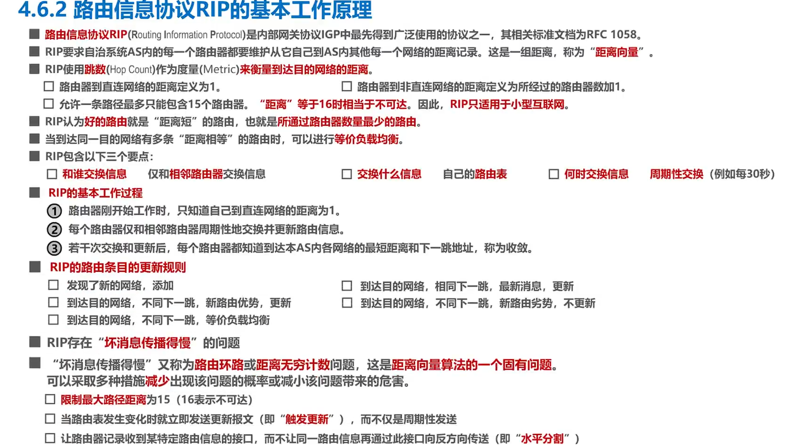
## 静态路由
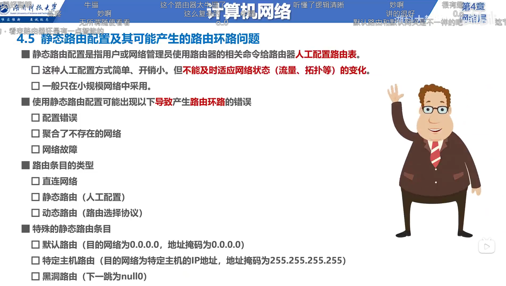
    可能产生的问题：路由环路
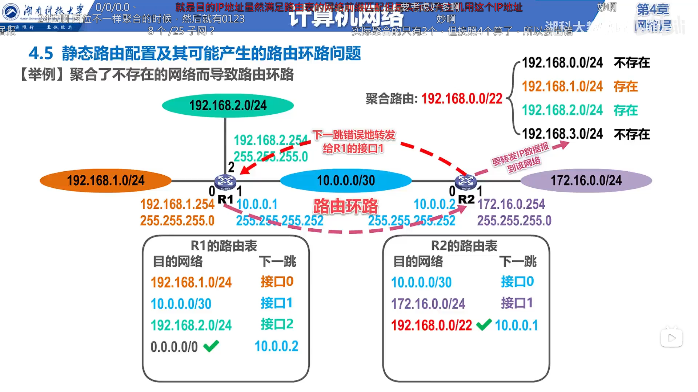
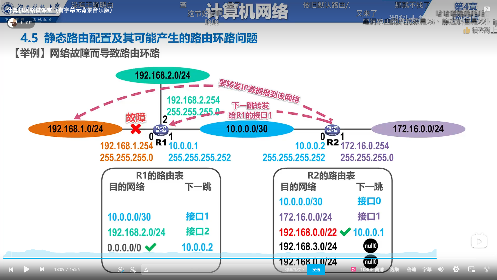
