## 物理层
    模拟信号：连续的，模拟信道---频带传输 ---调整解调
    数字信号：离散的，数字信道---基带传输 ---数字编码
### 信道复用
    码分复用CDM
    频分复用FDM
    波分复用WDM
    时分复用TDM
### 通信方式
    单工通信
    半双工通信
    双工通信
    并行传输
    串行传输
### 数字通信系统
    信源--信源编码--信道编码（差错检查）--调制器--信道--解调器--信道译码--信源译码--信宿
                                                |
                                                |
                                               噪声
### 传输速率
    码元传输速率Rb（码率）：单位的传输码元数目，单位波特（Baud）
    信息传输速率：系统在单位传输的信息

### 频带利用率
    在相同的时间系统的信息传输/信息所占的频带宽度

### 误码率和误信率

### 基带传输
    发送端：编码
    接收端：解码
    双极性的波形：冗余好
    归零波形：同步信号
    差分波形：电平是否跳变表示0，1，避免解码反了
    频带宽，利用率低
### 编码
    NOR：不归零编码
    Manchester：中间跳变表示时钟
    差分Manchester
## IPv4地址由32为bit组成，两部分：网络号，地址号  

### 子网划分:
    地址号全0或1不能使用（全0为网络地址，全1为广播地址）
#### A类   
    8位网络号------24位地址号  
    0XXX XXXX XXXX XXXX XXXX XXXX XXXX XXXX
    127.X.X.X地址不出网卡，仅用于本地环回测试
    可用网络号  0-126
#### B类
    16位网络号------16位地址号
    10XX XXXX XXXX XXXX XXXX XXXX XXXX XXXX
    可用网络号 
#### C类
    24位网络号------8位地址
    110X XXXX XXXX XXXX XXXX XXXX XXXX XXXX
## 子网掩码
    网络号+子网划分+地址号  
    子网号和地址号，都在地址里
    比例  
    网络号 子网号  地址号
    0000 0000 1000 0000 0000 0000 0000 0001  
    子网掩码是该网的网络地址和带子网号的网络地址的逻辑与运算  
    EX1:0000 0000 1000 0000 0000 0000 0000 0001
        子网掩码：0.128.0.0.0  
        该情况下  
        子网0的最小地址: 0000 0000 0000 0000 0000 0000 0000 0001
        最大地址:0000 0000 0111 1111 1111 1111 1111 1110
        广播地址:0000 0000 0111 1111 1111 1111 1111 1111
    EX2:0000 0000 1111 0000 0000 0000 0000 0001
        子网掩码：0.240.0.0.0
## 拓扑
    将网络中的设备抽象成点，连接抽象成线
    ### 总线型（Bus）
    ### 星型  
    ### 树型（拓展星型）  
    ### 环形  
    ### 网状型   
## Router 与 Switch

    Router:三层（网络层），利用IP地址寻址  
    通过查路由表来转发，连接不同的网络（如LAN到WAN，可以隔离广播域  
    可以跨网段通信，内置DHCP，NAT、DHCP、防火墙、VPN、拨号、无线等  
    Switch：二层（Data Link），利用MAC寻址  
    通过MAC地址表，查表转发，不能隔离广播域
    利用虚拟网络VLAN来区分不同的网络  
    不能跨网段  
    不分配IP，  具有VLAN、链路聚合、端口隔离、高速交换的功能
## IP数据报的发送
  

  

    IP数据报中的目的地址与路由表中的子网掩码进行与运算  
    得到一个网络地址，与目的地址比较，若是目的地址则，从记录的端口转发  

## 路由协议

### 分层次

### 常见协议

### 路由器的结构

### RIP工作原理

#### 工作过程

 

总结

## 静态路由

    可能产生的问题：路由环路

## 某一次的课后练习
[练习](/计算机网络/test1/test1.md)

## 开放最短路径OSPF （Open Shortest Path First）

### 基本原理
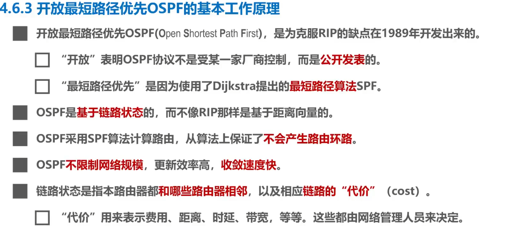  

### 用问候分组开维护邻居表

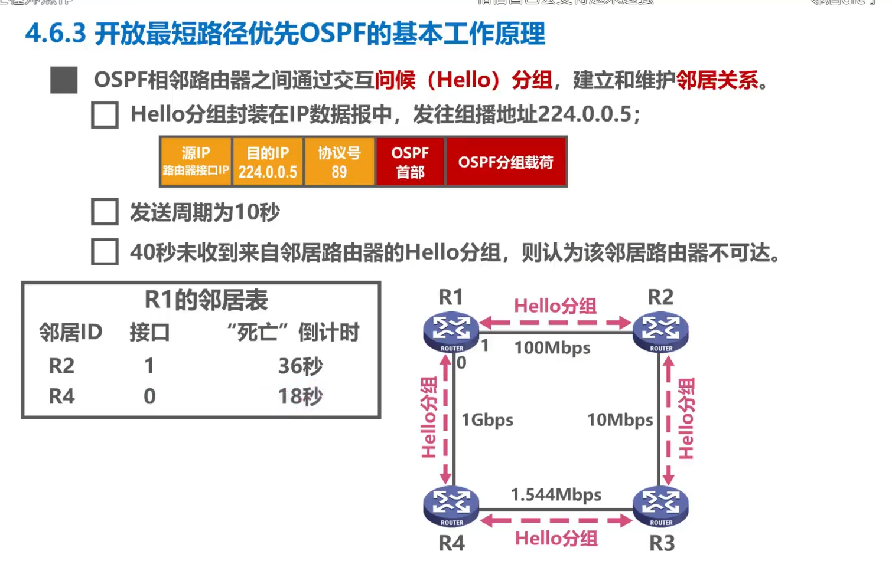

### 链路状态通告（LSA）和链路状态更新分组（LSU）

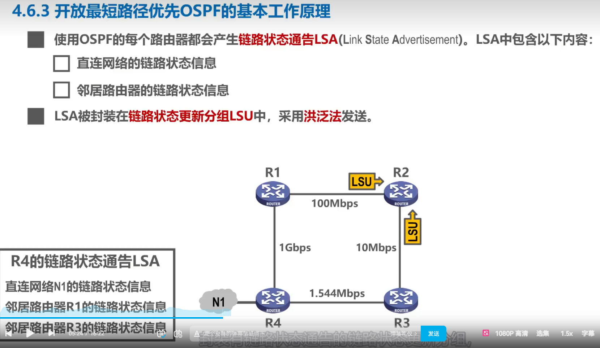
    每个路由里由LSDB来存储该网络上的LSU，并根据LSU，生成带权有向图，利用dij来得出最短路径

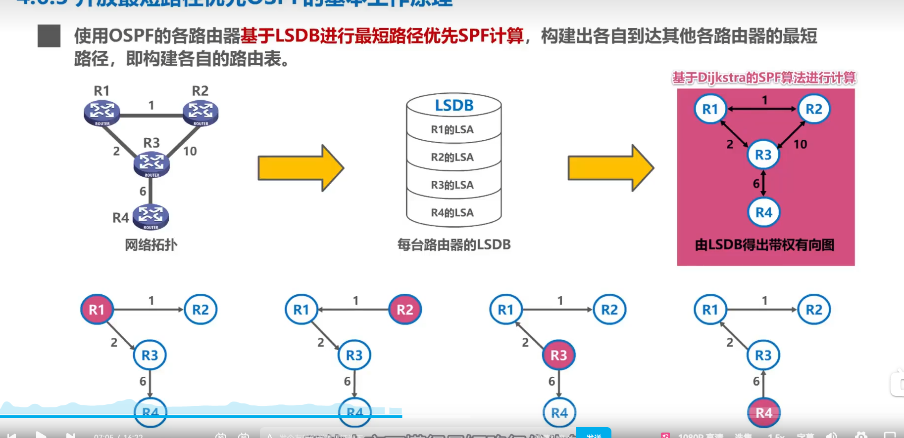

### 基本工作原理    

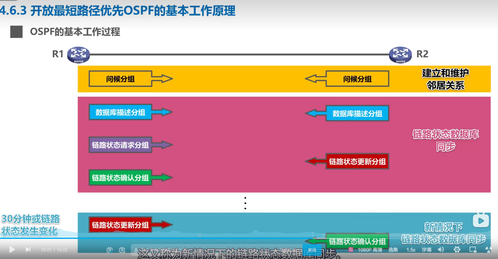

    多点接入的邻居关系建立
  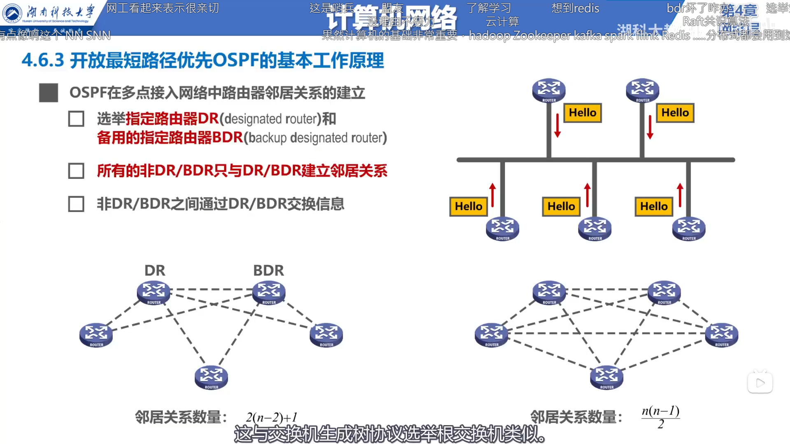

### 大规模网络（划分区域）
    每个区域的路由器数量 <= 200
    优势：
        可以把洪泛法的范围限制在一个区域内

    每一个接口堵在区域内的被称为区域内被称为区域内路由器（IR）：R1 ， R2 ， R8 ， R9
    边界路由器（ABR），有一个接口连接主干网络
    主干路由器（BBR），在主干网络中的路由器,
    AS边界路由器，主干网内连接其他的自治系统
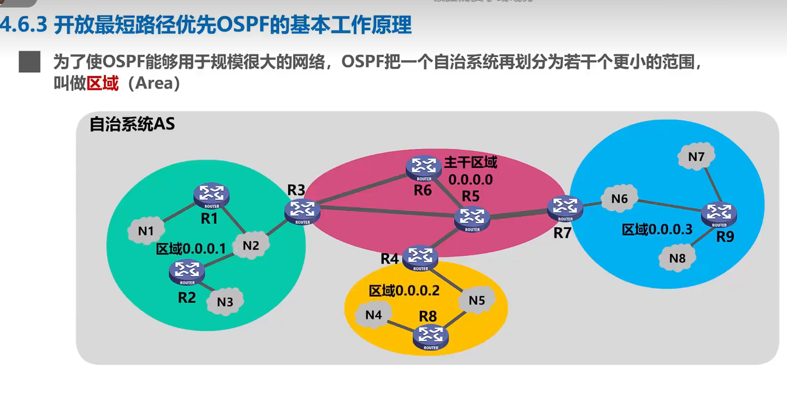

    边界路由器的工作内容
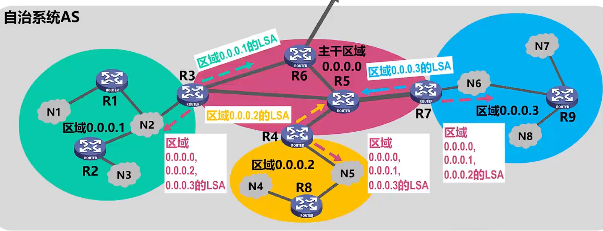

### 总结

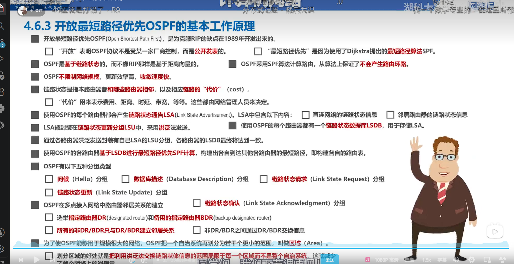

## 边界网关协议BGP的基本工作原理

    IGP设法分组在一个自治系统内尽可能有效的从原网络传输到目的网洛
    无需考虑自治系统外的策略  
    BGP发言人：
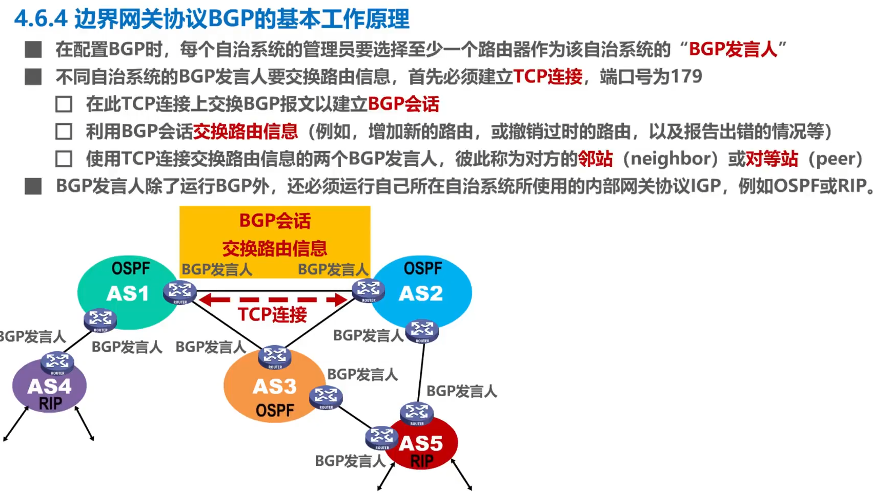

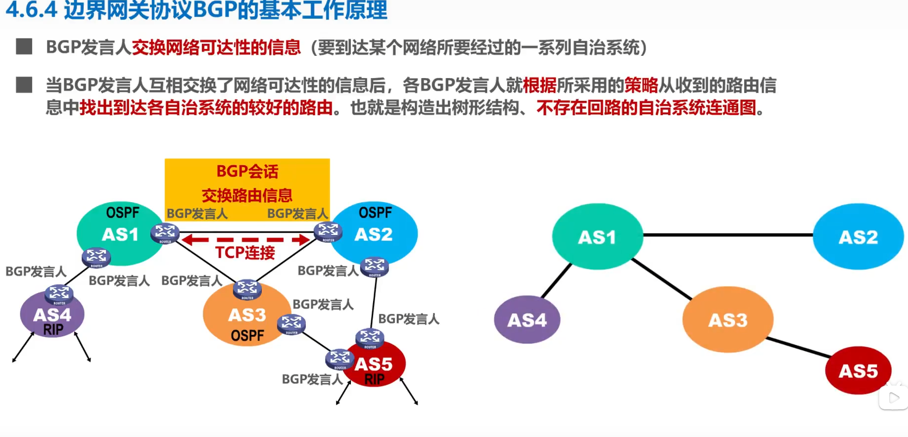

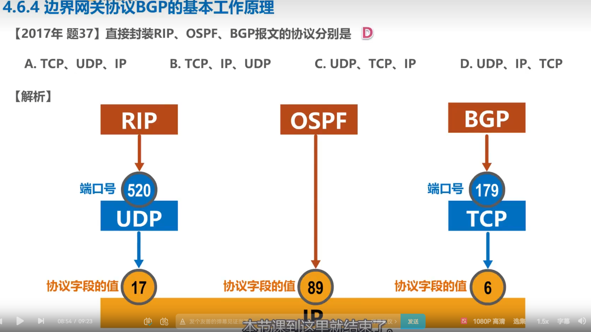

### 总结

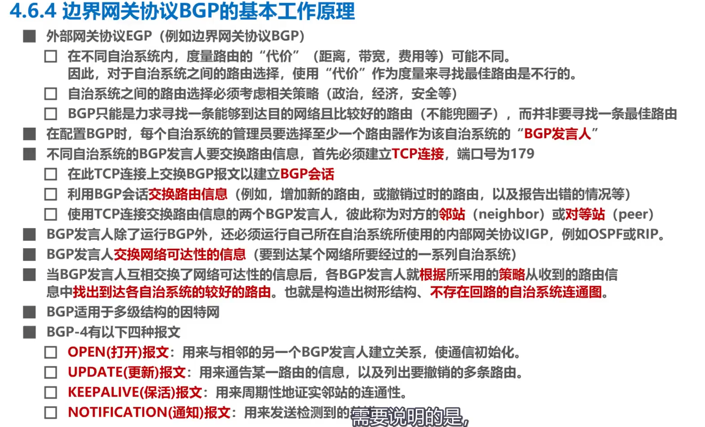

## IPV4数据包（IP数据报）

### 首部格式